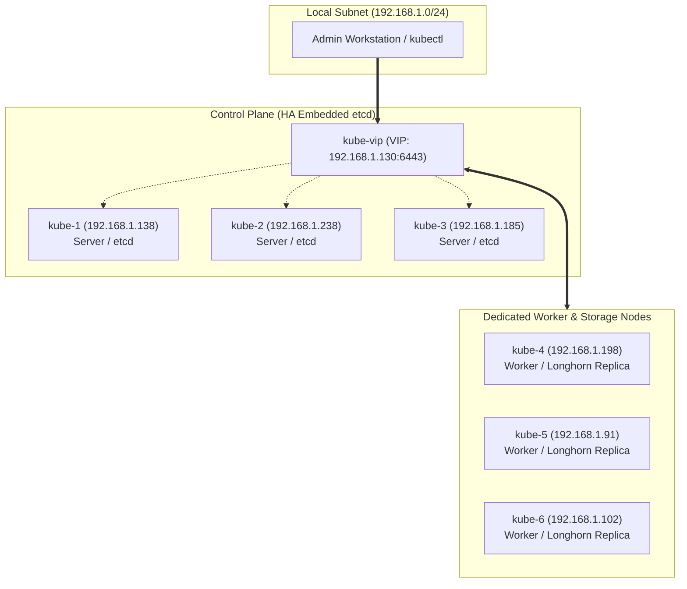
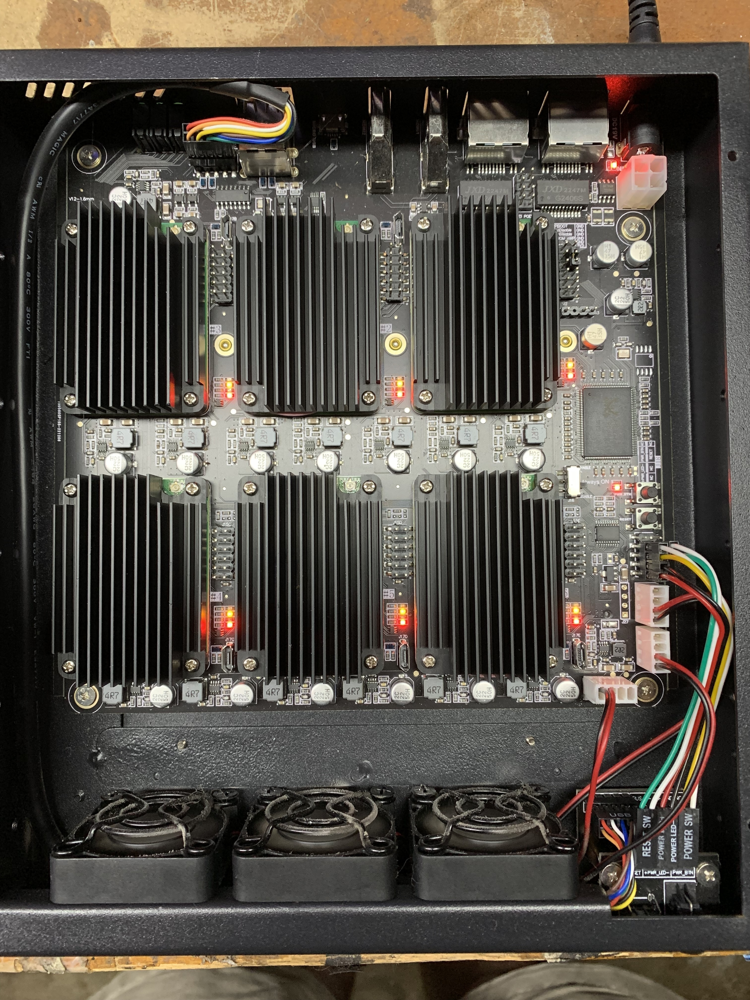
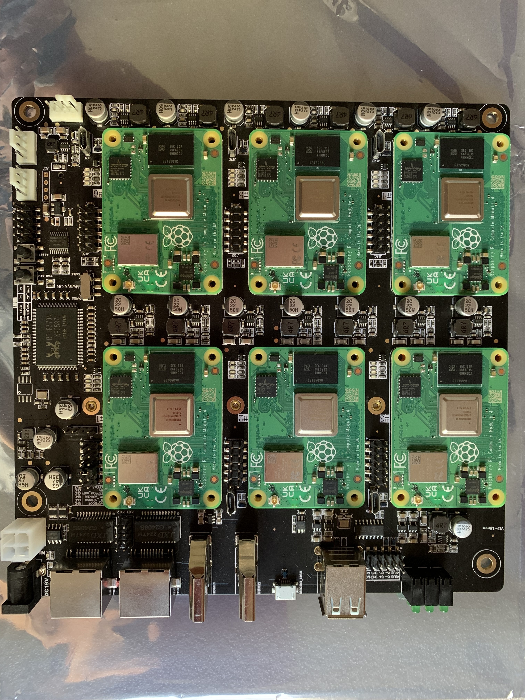
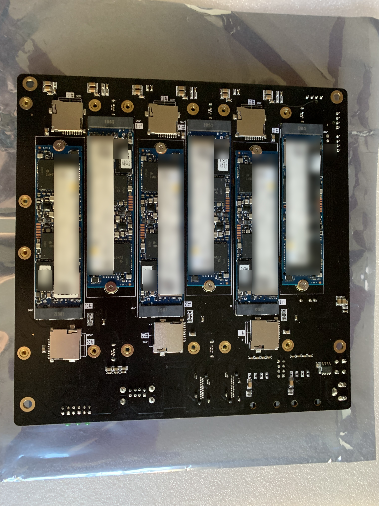
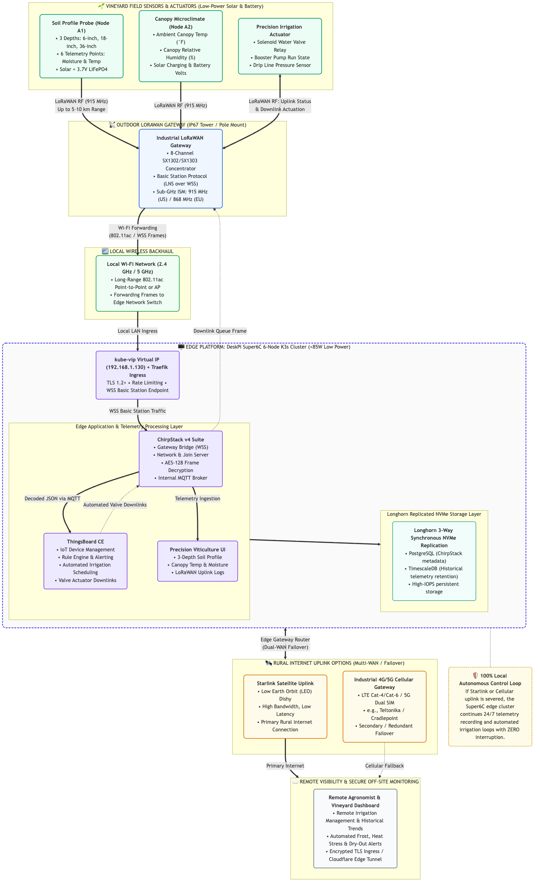
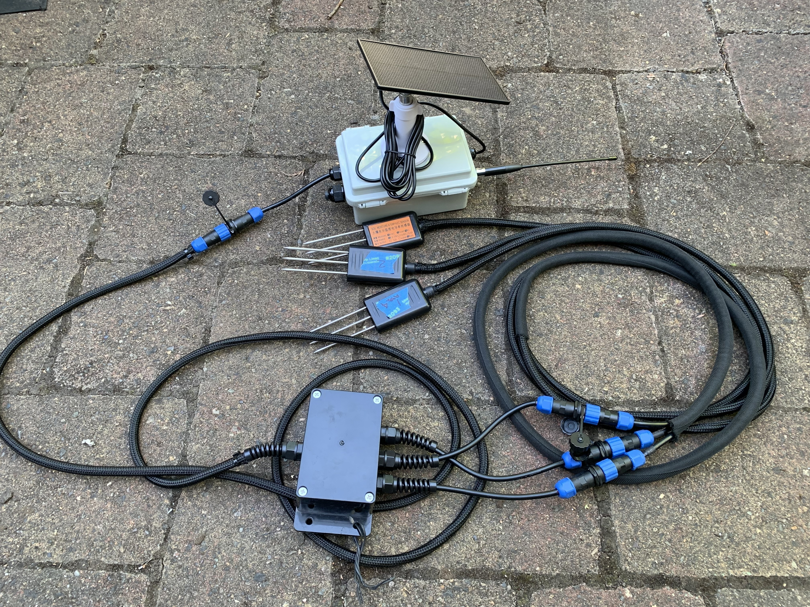
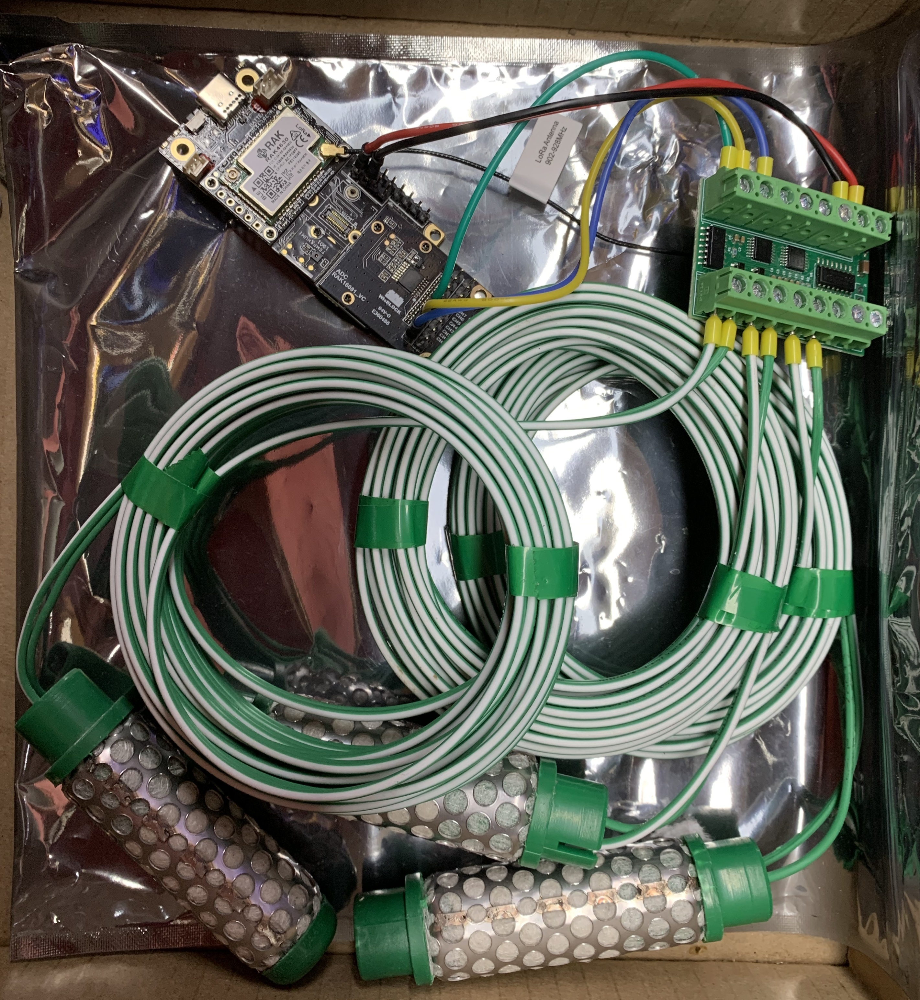
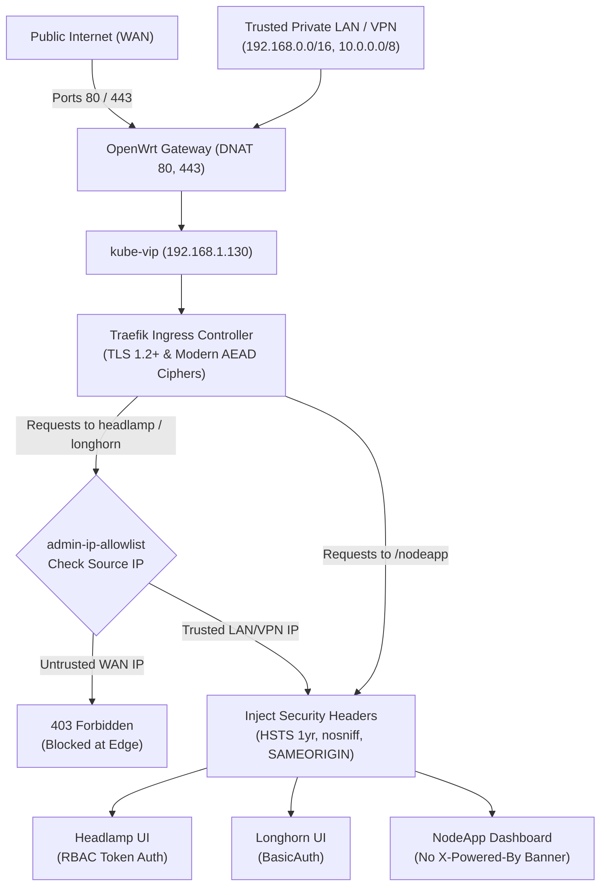

# Industrial IoT (IIoT) & Edge Computing Reference Architecture (6x CM4 Compute Modules)

[](LICENSE)
[](https://www.ansible.com/)
[](https://k3s.io/)
[](https://deskpi.com/)
[](https://www.raspberrypi.com/products/compute-module-4/)
[](docs/COMPLIANCE.md)
[](https://longhorn.io/)

An enterprise-grade, automated edge infrastructure framework deploying a 6-node **K3s Kubernetes HA cluster** on **Raspberry Pi Compute Module 4 (CM4)** hardware with high-speed NVMe storage, purpose-built as the foundational compute and security platform to host **ChirpStack (LoRaWAN sensor telemetry)** and **ThingsBoard (IoT management & automated irrigation)**.

This framework delivers:
- **True High Availability (HA):** 3-node embedded etcd control-plane with automated failover via **kube-vip** Layer 2 ARP virtual IP (`192.168.1.130`).
- **Distributed Block Storage:** **Longhorn** distributed persistent storage with 3-way cross-node volume replication on NVMe to safeguard historical telemetry and actuator state.
- **Cluster & Storage Web Dashboards:** **Headlamp** cluster-wide Web UI and **Longhorn UI** unified under `http://192.168.1.130/` and secured HTTPS domains.
- **Enterprise Security Hardening:** Defense-grade host and workload baseline aligned to **NIST SP 800-53 Rev 5**, **SOC 2 Type II**, and **CIS Benchmarks** (auditd 99 rules, fail2ban, umask 027, kernel blacklist, Restricted PSA).
- **Ingress Perimeter Defense:** Traefik IP allowlisting restricting admin dashboards to LAN/VPN (`192.168.0.0/16`, `10.0.0.0/8`), cluster-wide TLS 1.2+ cipher suites, automated HTTP $\rightarrow$ HTTPS 308 redirect, and HSTS headers.
- **Modular Playbook Design:** Clean, idempotent playbooks for hardware bootstrap, OS patching, compliance hardening, cluster installation, UI addons, and verification.
- **IoT & Telemetry Roadmap:** Full architectural blueprint and capacity sizing for upcoming **ChirpStack v4**, **ThingsBoard CE**, and MQTT broker deployment (see [`docs/IOT_LORAWAN_STACK_ARCHITECTURE.md`](docs/IOT_LORAWAN_STACK_ARCHITECTURE.md), [`docs/LORAWAN_CAPACITY_AND_STORAGE_ANALYSIS.md`](docs/LORAWAN_CAPACITY_AND_STORAGE_ANALYSIS.md), and [`docs/ROADMAP.md`](docs/ROADMAP.md)).

---

## 1. Architecture & Cluster Topology



### Node Role Matrix (DeskPi Super6C Mini-ITX Multi-Node Chassis)

The 6 Raspberry Pi CM4 modules are housed in a **DeskPi Super6C Mini-ITX cluster board**, featuring an on-board Gigabit switch backplane, dual external RJ45 uplinks, individual M.2 NVMe PCIe slots, and a single ATX power feed.

#### Physical Hardware & Compute Module Architecture

| Assembled Edge Appliance | 6x Raspberry Pi CM4 Compute Modules | Dedicated M.2 NVMe Storage Tier |
| :---: | :---: | :---: |
|  |  |  |
| **DeskPi Super6C Enclosure**<br/>Mini-ITX form factor, dual active PWM cooling fans, single ATX/DC power feed | **Compute Tier (ARM64)**<br/>6x Raspberry Pi CM4 (24 cores Cortex-A72 @ 1.5GHz, 24GB LPDDR4) | **Storage Tier (PCIe NVMe)**<br/>6x M.2 NVMe SSDs on dedicated PCIe Gen 2 lanes (50,000+ IOPS) |

| Hostname | IP Address | Hardware & Storage | K3s Role | Key Services |
| :--- | :--- | :--- | :--- | :--- |
| **`kube-1`** | `192.168.1.138` | CM4 4GB / 250GB NVMe (Slot 1) | Server (Primary) | etcd leader, API server, kube-vip leader, Traefik |
| **`kube-2`** | `192.168.1.238` | CM4 4GB / 250GB NVMe (Slot 2) | Server (Secondary) | etcd peer, API server, kube-vip backup |
| **`kube-3`** | `192.168.1.185` | CM4 4GB / 250GB NVMe (Slot 3) | Server (Secondary) | etcd peer, API server, kube-vip backup |
| **`kube-4`** | `192.168.1.198` | CM4 4GB / 250GB NVMe (Slot 4) | Agent (Worker) | Kubelet, Longhorn engine/replica, App workloads |
| **`kube-5`** | `192.168.1.91` | CM4 4GB / 250GB NVMe (Slot 5) | Agent (Worker) | Kubelet, Longhorn engine/replica, App workloads |
| **`kube-6`** | `192.168.1.102` | CM4 4GB / 250GB NVMe (Slot 6) | Agent (Worker) | Kubelet, Longhorn engine/replica, App workloads |
| **`kube-vip`**| `192.168.1.130` | Virtual Floating IP | Control Plane VIP | Shared resilient API endpoint across `kube-1..3` |

### Architectural Decision: Why K3s Over Upstream Kubernetes (K8s)?

Deploying standard upstream Kubernetes (`kubeadm` / K8s) on the DeskPi Super6C multi-node chassis was evaluated and deliberately rejected in favor of **K3s**:

1. **Hardware & Power Constraints**: The cluster operates on 6x Raspberry Pi CM4 compute modules (4GB RAM, Quad-Core Cortex-A72 @ 1.5GHz) housed in a compact Mini-ITX chassis. The entire system operates under a strict **<85W power budget** to support 100% off-grid 24/7 operation powered solely by a solar PV array and LiFePO4 battery storage, with zero dependency on local utility electricity.
2. **Upstream K8s is Heavy Overkill**: Upstream K8s control plane daemons (`kube-apiserver`, `controller-manager`, `scheduler`, standalone `etcd`, `kube-proxy`) consume **1.5 GiB – 2.0 GiB+ of idle RAM per node** (over 40%–50% of available memory on a 4GB CM4). Running standard K8s comfortably requires bulky, power-hungry x86 servers drawing 300W–500W+—completely defeating the low-SWaP (Size, Weight, and Power) edge appliance objective.
3. **K3s is Lightweight & Fully Certified**: K3s delivers 100% CNCF-certified Kubernetes APIs in a single binary consuming only **~512 MiB of RAM**. This preserves **~3.5GB (85%+) of memory on each compute module** for distributed block storage (Longhorn), edge ingress (Traefik), and upcoming telemetry workloads (ChirpStack & ThingsBoard).

### Architectural Rationale: Industrial Edge Silicon vs. Enterprise Rack Overkill

A common question regarding edge computing architectures is: *"Why deploy Raspberry Pi Compute Modules rather than a traditional enterprise 1U/2U rack server?"*

1. **The Physical & Thermal Edge Constraint**:
   - Traditional enterprise servers (e.g., Dell PowerEdge, HPE ProLiant) draw **350W–600W**, produce 75 dB of acoustic noise, generate significant heat, and require conditioned 240V AC power in climate-controlled server rooms.
   - Deploying rackmount servers into remote agricultural outbuildings, vineyard pump sheds, or off-grid solar enclosures is operationally and economically non-viable.
2. **The 40-Watt Operational Advantage**:
   - The entire six-node Super6C cluster—comprising compute, RAM, six dedicated PCIe NVMe SSDs, and an integrated gigabit switch backplane—idles at **~20W** and peaks at **~45W**.
   - When paired with a 12V 200Ah LiFePO4 battery and a 300W solar panel array, this ultra-efficient multi-node cluster runs 24/7/365 indefinitely off-grid, providing continuous autonomy even through consecutive cloudy days without requiring local utility electricity.
3. **Industrial Silicon (CM4) ≠ Consumer Hobbyist Pi**:
   - **Zero SD Cards**: Compute Module 4s interface directly over dedicated PCIe Gen 2 lanes to NVMe SSDs and industrial eMMC, eliminating flash corruption during power cuts.
   - **Industrial Temperature & Long-Term Availability**: The Broadcom BCM2711 silicon is rated for -20°C to +85°C operating environments, manufactured by Sony UK with commercial supply availability guaranteed through at least **2034**.
   - **Commercial Precedents**: Global industrial automation leaders deploy this exact CM4 silicon in factory PLCs and SCADA controllers, including **Siemens** (Simatic IOT2050), **OnLogic** (Factor 201/202), and **Kunbus** (Revolution Pi).
4. **Resilience Through Multi-Node Clustering (Eliminating SPOF)**:
   - A single $15,000 rack server represents a single point of failure (one motherboard, one backplane, one OS kernel). If a component fails, the site goes blind.
   - The Super6C provides true **N+2 Raft consensus** (`etcd`) and **3-way synchronous NVMe replication** (Longhorn). If a compute module physically fails, the floating VIP shifts in **<3 seconds** and storage fails over automatically with zero data loss. In the event of hardware failure, individual CM4 modules cost just ~$55 for modular replacement during maintenance, rather than replacing an entire proprietary server.

### End-to-End Field-to-Cloud Telemetry Pipeline

The diagram below illustrates the complete edge data lifecycle—from sub-surface soil and canopy field sensors transmitting via sub-GHz LoRaWAN RF, to an outdoor gateway forwarding over local Wi-Fi, to the Super6C K3s cluster running ChirpStack v4 and ThingsBoard CE, with multi-WAN rural uplink (Starlink satellite / 4G cellular):



#### In-Situ Field Sensor Deployments & Laboratory Bench Testing

Real-world telemetry is captured by custom low-power SDI-12 / RS485 soil moisture and temperature stations transmitting over sub-GHz LoRaWAN to the edge cluster:

| In-Situ Vineyard Field Station | Laboratory Calibration & Testing |
| :---: | :---: |
|  |  |
| **In-Situ Vineyard Soil Station**<br/>Multi-depth profile monitoring root-zone moisture tension (kPa) and soil temperature (°F) | **Laboratory Bench Testing**<br/>Pre-deployment sensor calibration, LoRaWAN RF join validation, and payload codec verification |

#### Key Pipeline Stages:
1. **Field Sensor Ingestion (LoRaWAN RF)**:
   - **Multi-Depth Soil Probes**: 3 depths (6" shallow, 18" root zone, 36" deep subsoil) monitoring both soil moisture tension (kPa) and soil temperature (°F) (6 telemetry points per station).
   - **Canopy Microclimate**: Real-time ambient canopy temperature and relative humidity/moisture.
   - **Long-Range Sub-GHz RF**: Field nodes transmit over 915 MHz (US) / 868 MHz (EU) LoRaWAN links, penetrating dense vineyard canopy cover over 5–10+ km with ultra-low battery consumption (3.7V LiFePO4 + solar).
2. **Outdoor LoRaWAN Gateway & Wi-Fi Backhaul**:
   - An IP67 outdoor gateway (8-channel SX1302/SX1303 concentrator) receives uplink frames and uses the Semtech Basic Station protocol over WebSockets.
   - Forwards packets via long-range 802.11ac Wi-Fi back to the edge networking hub.
3. **DeskPi Super6C Edge Compute (ChirpStack v4 & ThingsBoard CE)**:
   - **ChirpStack v4**: Decrypts AES-128 frame payloads, manages device join sessions, and publishes structured JSON to an internal MQTT broker.
   - **ThingsBoard CE & Automated Rule Engine**: Evaluates 18" root soil tension in real time. If tension exceeds the target dry-down threshold (>45 kPa), the rule engine issues downlink actuation commands to solenoid drip irrigation valves.
   - **Longhorn Replicated Storage**: Safeguards historical telemetry in PostgreSQL / TimescaleDB hypertables with 3-way synchronous NVMe replication.
4. **Rural Multi-WAN Uplink Options**:
   - **Primary Uplink**: **Starlink LEO Satellite** provides high-speed, low-latency Internet connectivity in remote rural terrain.
   - **Failover Uplink**: **Industrial 4G/5G Cellular Gateway** (e.g., Teltonika / Cradlepoint) with dual-SIM automatic failover.
5. **100% Local Autonomous Control Loop**:
   - If Starlink or cellular connectivity is disrupted by weather or rural network outages, the Super6C cluster operates with **complete local autonomy**—continuous 24/7 telemetry recording and automated irrigation loops execute uninterrupted without cloud dependency.

---

## 2. Directory Structure

```text
.
├── ansible.cfg                # Optimized SSH multiplexing, pipelining, and inventory settings
├── inventory/
│   ├── hosts.yml              # Cluster inventory (3 servers + 3 agents)
│   └── group_vars/
│       ├── all/
│       │   ├── vars.yml       # VIP, versions, CIDRs, domains, and compliance toggles
│       │   ├── vault.yml      # Ansible Vault secrets template with stub values
│       │   └── vault.yml.example # Reference template for vault configuration
│       ├── k3s_servers.yml    # Server-specific variables
│       └── k3s_agents.yml     # Agent-specific variables
├── playbooks/
│   ├── 00-ping.yml            # Connectivity & privilege verification
│   ├── 01-bootstrap.yml       # CM4 hardware bootstrap (cgroups, swap, NVMe noatime, hostnames)
│   ├── 02-patch.yml           # Rolling OS security patch updates & safe rebooting
│   ├── 03-security-harden.yml # NIST 800-53 / SOC 2 baseline (SSH, UFW, sysctl, auditd)
│   ├── 04-k3s-cluster.yml     # HA K3s install (kube-vip static pod + etcd join)
│   ├── 05-cert-manager.yml    # cert-manager deployment & Let's Encrypt ClusterIssuers
│   ├── 06-longhorn.yml        # Longhorn distributed storage & basicAuth Traefik ingress
│   ├── 07-headlamp.yml        # Headlamp cluster web UI with native RBAC & domain TLS
│   ├── 08-verify.yml          # End-to-end cluster health validation & kubeconfig export
│   ├── 09-nodeapp.yml         # NodeApp sensor dashboard deployment & Traefik ingress
│   ├── site.yml               # Master playbook running stages 00 through 08
│   └── reset.yml              # Complete cluster teardown and clean uninstallation
├── apps/
│   └── NodeApp/               # Precision Viticulture IIoT Telemetry Gateway application
│       ├── Dockerfile         # Multi-stage ARM64 container with /healthz probe
│       ├── app.js             # Express API with autonomous demo mode & MySQL pool
│       ├── telemetryService.js # 3-depth soil profile (6 values) & canopy microclimate generator
│       ├── db/
│       │   ├── schema.sql     # MySQL/MariaDB DDL (sensor_nodes, soil, canopy, LoRaWAN)
│       │   └── seed.sql       # Vineyard block sample datasets
│       ├── routes/            # Endpoints for canopy, soil, and LoRaWAN packet logs
│       └── views/             # Responsive EJS templates with real-time field status
├── scripts/
│   ├── build-and-import-nodeapp.sh # Automated ARM64 image builder & worker containerd importer
│   └── copy-headlamp-token.sh # Quick clipboard helper using pbcopy to retrieve Headlamp admin token
├── templates/
│   ├── audit-policy.yaml.j2   # Kubernetes API server audit logging policy
│   ├── cert-manager-issuers.yaml.j2 # Let's Encrypt Staging and Production ClusterIssuers
│   ├── headlamp.yaml.j2       # Headlamp UI deployment, RBAC, Services, & Traefik IngressRoute
│   ├── hosts.j2               # Unified /etc/hosts for DNS resolution across cluster
│   ├── k3s-agent-config.yaml.j2  # Agent node configuration
│   ├── k3s-server-config.yaml.j2 # Server node configuration (SANs, audit, secrets encryption)
│   ├── kube-vip.yaml.j2       # Kube-vip static pod manifest
│   ├── longhorn-ingress.yaml.j2  # Longhorn basicAuth, load balancer, and Traefik redirect
│   ├── nodeapp.yaml.j2        # NodeApp deployment, database secret, service, & Traefik routing
│   └── traefik-tls-options.yaml.j2 # Traefik cluster-wide TLS 1.2+ & modern cipher suites
├── docs/                      # Architectural guides, compliance crosswalk, and network diagrams
│   ├── ACME_SSL_ARCHITECTURE.md   # Architectural guide for Let's Encrypt with OpenWrt DDNS
│   ├── AWS_HYBRID_ANALYSIS.md     # AWS hybrid cloud cost & architectural analysis
│   ├── CHANGELOG.md               # Version history and changelog
│   ├── CLUSTER_HARDWARE_STACK_ANALYSIS.md # 6-node Super6C cluster capacity & multi-tier stack analysis
│   ├── COMPLIANCE.md              # Detailed mapping to NIST SP 800-53, SOC 2, and HITRUST
│   ├── IOT_LORAWAN_STACK_ARCHITECTURE.md  # LoRaWAN, MQTT, ChirpStack, ThingsBoard & telemetry guide
│   ├── LORAWAN_CAPACITY_AND_STORAGE_ANALYSIS.md # LoRaWAN gateway capacity, RF airtime & NVMe storage sizing
│   ├── OPENWRT_ALT_PORT_ROUTING.md # Alternate port (8443) routing & legacy gateway coexistence guide
│   ├── PHASE_2_CHIRPSTACK_THINGSBOARD_PERFORMANCE.md # Phase 2 DB performance & optimization guide
│   ├── ROADMAP.md                 # Enhancements, compliance backlog & architectural roadmap
│   ├── SDD.md                     # System Design Description & engineering specification
│   ├── TRAEFIK_SECURITY_AND_RATELIMITING.md # Ingress security, rate limiting, and DDoS defense reference
│   ├── field-test-soil.jpg        # In-situ vineyard field deployment of multi-depth soil probe
│   ├── lab-test-soil.jpg          # Laboratory sensor calibration and payload verification
│   ├── lorawan-iot-architecture.mmd # Source Mermaid definition for end-to-end LoRaWAN/IoT pipeline
│   ├── lorawan-iot-architecture.png # High-resolution PNG LoRaWAN/IoT architecture diagram
│   ├── network-setup.mmd          # Source Mermaid definition for network architecture diagram
│   ├── network-setup.png          # High-resolution PNG network architecture diagram
│   ├── super6c-case.jpg           # DeskPi Super6C assembled Mini-ITX edge cluster enclosure
│   ├── super6c-cm4.jpg            # 6x Raspberry Pi Compute Module 4 (CM4) compute modules installed
│   └── super6c-m2.jpg             # Dedicated M.2 NVMe SSD storage tier on PCIe Gen 2
├── lorawan-iot-architecture.png   # High-resolution PNG LoRaWAN/IoT architecture diagram (root copy)
├── network-setup.png              # High-resolution PNG network architecture diagram (root copy)
└── README.md
```

---

## 3. Pre-Flight Configuration: What to Update Before Use

Before executing playbooks against physical edge nodes, customize the following configuration files for your network and hardware environment:

### 1. Node Inventory (`inventory/hosts.yml`)
Set the IP addresses and hostnames for your 6 nodes:
- **`k3s_servers`**: Minimum 3 nodes (`kube-1`, `kube-2`, `kube-3`) to establish an etcd high-availability quorum. Set `ansible_host` and `node_ip` to match your local subnet. Note that `k3s_init_node: true` must be designated on the first leader (`kube-1`).
- **`k3s_agents`**: Dedicated worker nodes (`kube-4`, `kube-5`, `kube-6`) running edge workloads and Longhorn distributed NVMe storage replicas.

### 2. Network & Perimeter Settings (`inventory/group_vars/all/vars.yml`)
Review and customize cluster networking parameters:
- **`k3s_vip`**: Set to an unused static IP on your management LAN for `kube-vip` (default: `192.168.1.130`).
- **`k3s_vip_interface`**: Set to your physical interface name (`eth0` on CM4/Super6C).
- **`admin_subnets` & `traefik_admin_allowlist_cidrs`**: Restrict cluster administration (SSH, UFW, Headlamp, Longhorn UI) to your trusted CIDRs (e.g., `192.168.1.0/24`, `10.0.0.0/8`, `172.16.0.0/12`).
- **`base_domain`**: Your domain name for SSL ingress routing (e.g., `yourdomain.com`).
- **`ansible_user`**: Target SSH user provisioned on OS images (default: `admin`).

### 3. Hardware & OS Prerequisites
- **Operating System**: Debian 12 (Bookworm), Raspberry Pi OS Lite (64-bit), or Armbian.
- **Kernel cgroups**: Kubernetes requires memory cgroups. Add `cgroup_enable=cpuset cgroup_memory=1 cgroup_enable=memory` to `/boot/firmware/cmdline.txt` (or `/boot/cmdline.txt`) on each compute module and reboot.
- **SSH Key Authentication**: Install your workstation SSH public key on all nodes and verify passwordless sudo:
  ```bash
  ssh-copy-id admin@192.168.1.138
  # Repeat for kube-1 through kube-6, ensure sudo without password prompt:
  # admin ALL=(ALL) NOPASSWD:ALL
  ```
- **NVMe Storage**: Worker nodes (`kube-4..6`) must have NVMe SSDs mounted at `/var/lib/longhorn` for Longhorn CSI replicated volumes.

### 4. Secrets Management & Ansible Vault (`vault.yml`)

The repository includes an unencrypted template file [`inventory/group_vars/all/vault.yml`](inventory/group_vars/all/vault.yml) (and a matching backup [`vault.yml.example`](inventory/group_vars/all/vault.yml.example)) with clearly marked `CHANGEME` stub values.

> [!IMPORTANT]
> **Why is `vault.yml` unencrypted by default in this repository?**
> In open-source reference repositories, committing an encrypted vault file prevents users who clone the repo from inspecting variable schemas or running dry-runs without decryption errors. Providing a stub template makes the required secrets schema self-documenting and immediately runnable in lab environments. **Before deploying to production, follow the steps below to populate and encrypt your secrets.**

#### Required Secret Variables to Update:

| Variable | Description | Generation Method |
| :--- | :--- | :--- |
| `vault_longhorn_admin_user` | Storage UI administrator username | Plaintext (e.g., `kube-admin`) |
| `vault_longhorn_admin_password` | Storage UI administrator password | Strong random password |
| `vault_longhorn_htpasswd` | Bcrypt htpasswd hash for Traefik basicAuth | `htpasswd -nb -B kube-admin "<password>"` |
| `vault_acme_email` | Let's Encrypt account email for SSL expiry alerts | Valid email address |
| `vault_base_domain` | Root domain for TLS IngressRoutes | Your public or internal domain |
| `vault_k3s_token` | K3s node-join cryptographic cluster token | `openssl rand -hex 16` |
| `vault_nodeapp_session_secret` | Web application session encryption key | `openssl rand -hex 32` |
| `vault_nodeapp_db_*` | Telemetry database host, user, password, database name | Database credentials |

#### Step-by-Step Instructions to Encrypt the Vault File:

1. **Populate Secrets**:
   Edit [`inventory/group_vars/all/vault.yml`](inventory/group_vars/all/vault.yml) with your actual credentials and hashes.

2. **Generate a Vault Password File**:
   Create a local password file on your workstation:
   ```bash
   openssl rand -base64 32 > .vault_pass
   chmod 600 .vault_pass
   ```
   *(Note: `.vault_pass` is permanently ignored by `.gitignore` to prevent committing secrets to version control).*

3. **Encrypt the Vault File**:
   ```bash
   ansible-vault encrypt inventory/group_vars/all/vault.yml --vault-password-file .vault_pass
   ```

4. **Enable Automatic Decryption in `ansible.cfg`**:
   Uncomment line 12 in `ansible.cfg`:
   ```ini
   vault_password_file = .vault_pass
   ```
   *(Alternatively, pass `--vault-password-file .vault_pass` or `--ask-vault-pass` on the CLI).*

5. **Viewing or Editing Secrets in the Future**:
   ```bash
   # View decrypted contents in terminal:
   ansible-vault view inventory/group_vars/all/vault.yml

   # Open encrypted file in your default text editor:
   ansible-vault edit inventory/group_vars/all/vault.yml

   # Decrypt back to plaintext:
   ansible-vault decrypt inventory/group_vars/all/vault.yml

   # Change the encryption password:
   ansible-vault rekey inventory/group_vars/all/vault.yml
   ```

### 5. DNS & Edge Router Port Forwarding
For public ingress and Let's Encrypt ACME HTTP-01 automated certificates:
- **Router Port Forwarding**: Forward external WAN ports `80` (HTTP) and `443` (HTTPS) to the `k3s_vip` (`192.168.1.130`).
- **DNS Records**: Point public DNS A records (`*.example.com` or `headlamp.example.com`, `longhorn.example.com`, `nodeapp.example.com`) to your external WAN IP.

---

## 4. Quick Start & Deployment Execution

### Step 1: Verify Connectivity
Validate SSH key authentication and passwordless sudo across all 6 nodes:
```bash
ansible-playbook playbooks/00-ping.yml
```

### Step 2: Full Cluster Deployment (Master Playbook)
Run the complete end-to-end automation:
```bash
ansible-playbook playbooks/site.yml
```

### Step 3: Granular Staged Execution (Recommended for Demos)
You can execute stages individually to observe each layer:

1. **Hardware & OS Bootstrap:**
   ```bash
   ansible-playbook playbooks/01-bootstrap.yml
   ```
   *Enables memory cgroups in `/boot/firmware/cmdline.txt`, disables swap, installs `open-iscsi`/`nfs-common`, cleans legacy container network interfaces, and sets hostnames.*

2. **OS Patching:**
   ```bash
   ansible-playbook playbooks/02-patch.yml
   ```
   *Runs `apt dist-upgrade` and executes rolling reboots sequentially.*

3. **Security Hardening (NIST / SOC 2 / HITRUST):**
   ```bash
   ansible-playbook playbooks/03-security-harden.yml
   ```
   *Hardens SSH daemon, configures UFW firewall for K3s mesh, applies kernel sysctl protections, and activates `auditd`.*

4. **K3s HA Cluster Deployment:**
   ```bash
   ansible-playbook playbooks/04-k3s-cluster.yml
   ```
   *Deploys `kube-vip` static pod, initializes `kube-1`, joins `kube-2` & `kube-3` to etcd, and connects worker agents `kube-4..6`.*

5. **cert-manager & ACME ClusterIssuers:**
   ```bash
   ansible-playbook playbooks/05-cert-manager.yml
   ```
   *Installs cert-manager controllers and configures Let's Encrypt production and staging ClusterIssuers.*

6. **Longhorn Distributed Storage with basicAuth:**
   ```bash
   ansible-playbook playbooks/06-longhorn.yml
   ```
   *Installs Longhorn CSI, establishes 3-way NVMe replica storage, and configures Traefik basicAuth for `longhorn.example.com`.*

7. **Headlamp Cluster Web UI with RBAC & Domain TLS:**
   ```bash
   ansible-playbook playbooks/07-headlamp.yml
   ```
   *Deploys Headlamp with token-based Kubernetes RBAC authentication, TLS ingress for `headlamp.example.com`, and automated token generation.*

8. **Validation & Kubeconfig Export:**
   ```bash
   ansible-playbook playbooks/08-verify.yml
   ```
   *Pulls kubeconfig to `~/.kube/config-super6c-edge`, queries cluster readiness, and prints all dashboard URLs, tokens, and vault credentials.*

9. **Deploy Precision Viticulture Telemetry Portal:**
   ```bash
   # Build ARM64 image and stream directly into worker node containerd:
   ./scripts/build-and-import-nodeapp.sh

   # Deploy manifests, secrets, and Traefik Ingress:
   ansible-playbook playbooks/09-nodeapp.yml
   ```
   *Deploys HA telemetry pods across worker nodes with `/healthz` liveness/readiness probes, mounts database secrets, and exposes endpoints at `http://192.168.1.130/nodeapp/temp` and `https://nodeapp.example.com`. Operates autonomously in demo mode with live simulated 3-depth soil profiles (moisture & temperature) and canopy microclimate metrics, or connects to external MySQL/MariaDB via `vault_nodeapp_db_*`.*

---

## 5. Managing the Cluster & Web Dashboards

### Cluster Management with kubectl
Export the generated kubeconfig on your control workstation:
```bash
export KUBECONFIG=~/.kube/config-super6c-edge
kubectl get nodes -o wide
```

Expected output:
```text
NAME     STATUS   ROLES                       AGE   VERSION        INTERNAL-IP     OS-IMAGE                         KERNEL-VERSION
kube-1   Ready    control-plane,etcd,master   76m   v1.31.5+k3s1   192.168.1.138   Debian GNU/Linux 12 (bookworm)   6.12.34+rpt-rpi-v8
kube-2   Ready    control-plane,etcd,master   72m   v1.31.5+k3s1   192.168.1.238   Debian GNU/Linux 12 (bookworm)   6.12.34+rpt-rpi-v8
kube-3   Ready    control-plane,etcd,master   71m   v1.31.5+k3s1   192.168.1.185   Debian GNU/Linux 12 (bookworm)   6.12.34+rpt-rpi-v8
kube-4   Ready    worker                      71m   v1.31.5+k3s1   192.168.1.198   Debian GNU/Linux 12 (bookworm)   6.12.34+rpt-rpi-v8
kube-5   Ready    worker                      71m   v1.31.5+k3s1   192.168.1.91    Debian GNU/Linux 12 (bookworm)   6.12.34+rpt-rpi-v8
kube-6   Ready    worker                      71m   v1.31.5+k3s1   192.168.1.102   Debian GNU/Linux 12 (bookworm)   6.12.34+rpt-rpi-v8
```

### Web Dashboards & Authentication

| Dashboard / Service | Domain Access URL (SSL) | Local / VIP Fallback | Access Scope | Authentication & Security |
| :--- | :--- | :--- | :--- | :--- |
| **Headlamp (Cluster UI)** | **[https://headlamp.example.com](https://headlamp.example.com)** | `http://192.168.1.130/headlamp` | **LAN Only** (`192.168.0.0/16`, `10.0.0.0/8`). WAN blocked (403). | **Native Kubernetes RBAC**. Requires ServiceAccount Bearer token (displayed by `08-verify.yml`). |
| **Longhorn (Storage UI)** | **[https://longhorn.example.com](https://longhorn.example.com)** | `http://192.168.1.130/longhorn` | **LAN Only** (`192.168.0.0/16`, `10.0.0.0/8`). WAN blocked (403). | **Traefik HTTP BasicAuth**. Protected by username `kube-admin` and random bcrypt-hashed password in Ansible Vault. |
| **NodeApp (Sensor UI)** | **[https://nodeapp.example.com/nodeapp/temp](https://nodeapp.example.com/nodeapp/temp)** | `http://192.168.1.130/nodeapp/temp` | **Public WAN & LAN** | HTTP $\rightarrow$ HTTPS 308 redirect, HSTS, `X-Powered-By` suppressed, secure session secret. |
| **Longhorn (Direct LB)** | — | `http://192.168.1.130:8080` | Local Subnet | Dedicated Klipper LoadBalancer bypass port for local storage operations. |
| **Headlamp (Direct LB)** | — | `http://192.168.1.130:8081/headlamp/` | Local Subnet | Dedicated Klipper LoadBalancer bypass port. |

> [!TIP]
> **Quick Headlamp Login (macOS Clipboard)**:  
> Run `./scripts/copy-headlamp-token.sh` to automatically extract and copy the admin Bearer token directly into your macOS clipboard buffer via `pbcopy`. Then simply press `Cmd+V` on the Headlamp login page.

### Ingress Perimeter Defense & HTTPS Security Architecture



Key security mechanisms applied:
1. **Perimeter IP Filtering**: Traefik `ipAllowList` (`admin-ip-allowlist`) isolates sensitive control surfaces (Headlamp and Longhorn) from public WAN scans while granting zero-friction access to trusted local and VPN subnets (`192.168.0.0/16`, `10.0.0.0/8`, `172.16.0.0/12`).
2. **Cryptographic TLS Hardening**: Traefik `TLSOption` (`kube-system/default`) enforces `VersionTLS12` minimum and permits only modern AEAD cipher suites (`AES-128-GCM`, `AES-256-GCM`, `CHACHA20-POLY1305`). Legacy TLS 1.0 and 1.1 handshakes are rejected.
3. **HTTP $\rightarrow$ HTTPS Enforcement**: Automatic HTTP 308 Permanent Redirection on public application routes (`nodeapp-redirect-https`).
4. **Browser Security Headers**: Traefik `headers` middleware injects `Strict-Transport-Security` (31536000s; includeSubDomains; preload), `X-Content-Type-Options: nosniff`, `X-Frame-Options: SAMEORIGIN`, and restrictive `Permissions-Policy`.
5. **Application Fingerprint Suppression**: Disabled `X-Powered-By: Express` in `apps/NodeApp/app.js` and protected session state with parameterized Kubernetes secrets and `httpOnly`/`sameSite: 'lax'` cookie attributes.
6. **DDoS Mitigation & Traffic Shaping**: Active Traefik `rateLimit` (100 req/min, burst 30 returning HTTP 429), `inFlightReq` (max 15 concurrent requests per source IP defending against Slowloris), and `buffering` (2 MB max body limit rejecting payload bombs with HTTP 413) on public ingress routes.

---

## 6. Edge Fault Tolerance & Resilience Verification

### Scenario A: High Availability Virtual IP Failover
1. In a terminal, run continuous ping or API calls to the VIP:
   ```bash
   while true; do kubectl get nodes >/dev/null && echo "API OK: $(date)" || echo "API FAIL"; sleep 1; done
   ```
2. Reboot or power down `kube-1` (the initial leader):
   ```bash
   ssh admin@kube-1 "sudo reboot"
   ```
3. Observe `kube-vip` automatically shift the VIP (`192.168.1.130`) to `kube-2` in <3 seconds without dropping `kubectl` access.

### Scenario B: Resilient Storage Failover with Longhorn
1. Deploy a StatefulSet claiming a `longhorn` PersistentVolume.
2. Verify volume status in the Longhorn UI (or via `kubectl get pvc`).
3. Drain one worker node:
   ```bash
   kubectl drain kube-4 --delete-emptydir-data --ignore-daemonsets
   ```
4. Confirm the pod reschedules onto another worker and re-attaches the distributed volume seamlessly.

---

## 7. Teardown & Reset
To completely remove K3s, purge Longhorn storage, reset network interfaces, and restore nodes to a pristine state:
```bash
ansible-playbook playbooks/reset.yml
```

---

## 8. License & Permitted Use

This project is open-source and licensed under the **[PolyForm Noncommercial License 1.0.0](LICENSE)**.

### Permitted Uses (Noncommercial):
* Personal study, education, academic coursework, and experimentation.
* Non-commercial edge computing and IoT research.
* Evaluation, security research, and vulnerability testing.

### Prohibited Uses:
* Commercial advantage, monetary compensation, or revenue generation.
* Internal operational or infrastructure use within a for-profit commercial entity or enterprise.
* Paid managed services, commercial hosting, or paid consulting based on this software.

For commercial licensing inquiries, enterprise production deployments, or custom arrangements, please contact **kanzpaul@gmail.com**.

