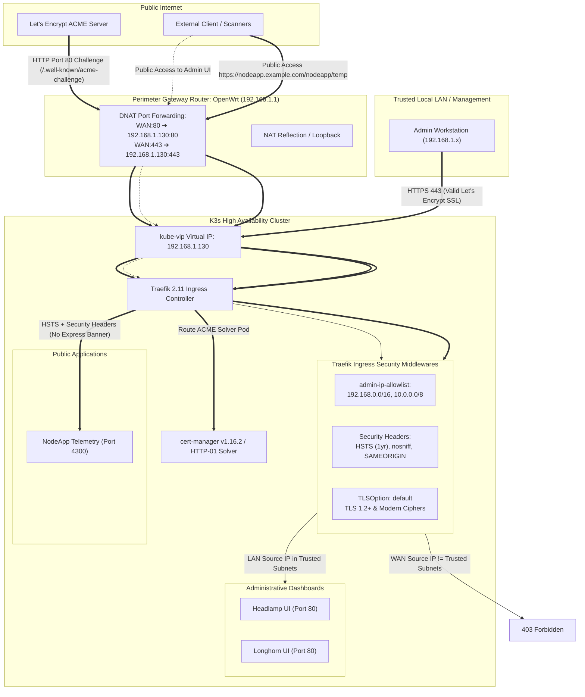

# ACME Let's Encrypt SSL Architecture & Implementation Guide
## K3s HA Cluster with OpenWrt Dynamic DNS & Traefik Ingress

**Date:** 2026-09-12  
**Target Architecture:** 6-Node Raspberry Pi CM4 K3s Cluster (`192.168.1.130`)  
**Upstream Gateway:** OpenWrt 23.05.5 Gateway with Dynamic DNS & Port Forwarding  
**Previous Reference:** Legacy Edge Gateway  

---

## 1. Executive Summary & Topology

In the previous architecture, an edge gateway managed Let's Encrypt ACME certificates via an automated HTTP-01 challenge plugin (`/.well-known/acme-challenge`) receiving forwarded traffic from OpenWrt on ports 80 and 443.

In the **K3s HA cluster**, the ingress layer is powered by **Traefik**, fronted by the `kube-vip` Layer 2 virtual IP (`192.168.1.130`). Because OpenWrt maintains Dynamic DNS (DDNS) for your registered domains (e.g., `example.com`, `yourdomain.com`, etc.) and forwards WAN ports 80 and 443, **ACME HTTP-01 validation works natively without requiring DNS provider API keys**.

### Network & Security Architecture Diagram



---

## 2. Router Configuration (OpenWrt 23.05.5)

To route incoming traffic to the new K3s cluster:

1. **Firewall Port Forwarding (`/etc/config/firewall` or LuCI)**:
   Update the existing port forwarding destination from the legacy gateway node to the K3s VIP:
   * **HTTP (Port 80)**: `WAN:80` $\rightarrow$ `192.168.1.130:80` (Required for ACME HTTP-01 challenge)
   * **HTTPS (Port 443)**: `WAN:443` $\rightarrow$ `192.168.1.130:443` (Encrypted web traffic)

2. **Local DNS / NAT Hairpinning (`/etc/config/dhcp` or LuCI)**:
   Ensure **NAT Loopback / Reflection** is enabled on the port forward so LAN clients connecting to public domain names route cleanly to `192.168.1.130`.
   * *Alternative (Split-Horizon DNS)*: Add static hostnames in OpenWrt `dnsmasq`:
     ```text
     headlamp.example.com -> 192.168.1.130
     longhorn.example.com -> 192.168.1.130
     ```

---

## 3. Implementation Options in K3s

### Option A: `cert-manager` with HTTP-01 (Kubernetes-Native Standard)

`cert-manager` runs as a cluster add-on and creates native Kubernetes `Secret` resources containing the TLS certificate and private key.

#### A.1. Architecture
* Deploys `cert-manager`, `cainjector`, and `webhook` controllers.
* A `ClusterIssuer` is configured with Let's Encrypt production.
* When a certificate is requested, `cert-manager` spins up a temporary solver pod and configures Traefik to route `/.well-known/acme-challenge` to that solver.
* Upon validation, the certificate is stored in a standard Kubernetes Secret (`tls.crt`, `tls.key`), which Traefik IngressRoutes consume.

#### A.2. ClusterIssuer Manifest
```yaml
apiVersion: cert-manager.io/v1
kind: ClusterIssuer
metadata:
  name: letsencrypt-prod
spec:
  acme:
    server: https://acme-v02.api.letsencrypt.org/directory
    email: admin@example.com
    privateKeySecretRef:
      name: letsencrypt-prod-account-key
    solvers:
      - http01:
          ingress:
            class: traefik
```

#### A.3. IngressRoute Integration
```yaml
apiVersion: traefik.io/v1alpha1
kind: IngressRoute
metadata:
  name: headlamp-tls
  namespace: headlamp
spec:
  entryPoints:
    - websecure
  routes:
    - match: Host(`headlamp.example.com`)
      kind: Rule
      middlewares:
        - name: lan-whitelist
      services:
        - name: headlamp
          port: 80
  tls:
    secretName: headlamp-tls-cert
```

---

### Option B: Traefik Native ACME via `HelmChartConfig` (Lightweight)

K3s installs Traefik via a Helm chart managed by the K3s Add-On controller. Traefik has built-in ACME challenge support that requires **zero extra controllers or CRDs**.

#### B.1. Architecture
* Configured by placing a `HelmChartConfig` in `/var/lib/rancher/k3s/server/manifests/traefik-config.yaml`.
* Traefik directly answers ACME challenges on port 80 and writes certificates to `/data/acme.json`.
* IngressRoutes simply reference `tls.certResolver: letsencrypt`.

#### B.2. Traefik HelmChartConfig Manifest
```yaml
apiVersion: helm.cattle.io/v1
kind: HelmChartConfig
metadata:
  name: traefik
  namespace: kube-system
spec:
  valuesContent: |-
    persistence:
      enabled: true
      path: /data
      size: 1Gi
      storageClass: longhorn
    additionalArguments:
      - "--certificatesresolvers.letsencrypt.acme.email=admin@example.com"
      - "--certificatesresolvers.letsencrypt.acme.storage=/data/acme.json"
      - "--certificatesresolvers.letsencrypt.acme.httpchallenge=true"
      - "--certificatesresolvers.letsencrypt.acme.httpchallenge.entrypoint=web"
```

#### B.3. IngressRoute Integration
```yaml
apiVersion: traefik.io/v1alpha1
kind: IngressRoute
metadata:
  name: headlamp-tls
  namespace: headlamp
spec:
  entryPoints:
    - websecure
  routes:
    - match: Host(`headlamp.example.com`)
      kind: Rule
      middlewares:
        - name: lan-whitelist
      services:
        - name: headlamp
          port: 80
  tls:
    certResolver: letsencrypt
```

---

## 4. Implemented Security Controls: Defense-in-Depth

> [!CAUTION]
> Because WAN port 443 forwards directly to Traefik, public domains pointing to the home IP could expose administrative dashboards to the internet. Headlamp has full `cluster-admin` RBAC and Longhorn controls cluster block storage. **Public access to administrative web UIs is strictly blocked at the ingress layer.**

To satisfy **NIST SP 800-53 (AC-3, SC-7, SC-8, SC-13)** and **SOC 2 Type II**, five integrated security layers are active:

### 4.1. IP Allowlisting Perimeter Defense (`admin-ip-allowlist`)
Configured in `templates/headlamp.yaml.j2` and `templates/longhorn-ingress.yaml.j2`:
```yaml
apiVersion: traefik.io/v1alpha1
kind: Middleware
metadata:
  name: admin-ip-allowlist
spec:
  ipAllowList:
    sourceRange:
      - "192.168.0.0/16"    # Covers cluster (192.168.1.x) & management networks
      - "10.0.0.0/8"         # Trusted LAN / VPN subnets
      - "172.16.0.0/12"      # Private subnets
      - "127.0.0.1/32"       # Loopback
```

### 4.2. Traefik Hardened TLS Options (`TLSOption: default`)
Configured in `templates/traefik-tls-options.yaml.j2` (`kube-system` namespace) to govern all IngressRoutes:
```yaml
apiVersion: traefik.io/v1alpha1
kind: TLSOption
metadata:
  name: default
  namespace: kube-system
spec:
  minVersion: VersionTLS12
  cipherSuites:
    - TLS_ECDHE_ECDSA_WITH_AES_128_GCM_SHA256
    - TLS_ECDHE_RSA_WITH_AES_128_GCM_SHA256
    - TLS_ECDHE_ECDSA_WITH_AES_256_GCM_SHA384
    - TLS_ECDHE_RSA_WITH_AES_256_GCM_SHA384
    - TLS_ECDHE_ECDSA_WITH_CHACHA20_POLY1305
    - TLS_ECDHE_RSA_WITH_CHACHA20_POLY1305
  sniStrict: false
```
*Enforces TLS 1.2+ and modern AEAD ciphers; rejects legacy TLS 1.0/1.1.*

### 4.3. Standard Browser Security Headers
Injected by Traefik `headers` middleware across all routes:
* **HSTS (`Strict-Transport-Security`)**: `max-age=31536000; includeSubDomains; preload` (1-year policy).
* **MIME Sniffing Prevention**: `X-Content-Type-Options: nosniff`.
* **Clickjacking Mitigation**: `X-Frame-Options: SAMEORIGIN`.
* **XSS Filter**: `X-XSS-Protection: 1; mode=block`.
* **Referrer Policy**: `strict-origin-when-cross-origin`.
* **Permissions Policy**: `geolocation=(), camera=(), microphone=()`.

### 4.4. Automatic HTTP $\rightarrow$ HTTPS Redirection
Configured via `redirectScheme` middleware (`nodeapp-redirect-https`):
* Unencrypted HTTP requests (`http://.../nodeapp/temp`) return `HTTP/1.1 308 Permanent Redirect` directly to `https://...`.

### 4.5. Application Layer Hardening (`NodeApp`)
* **Framework Fingerprinting**: Disabled via `app.disable("x-powered-by")` in `apps/NodeApp/app.js` (strips `X-Powered-By: Express`).
* **Session Hardening**: Secure session secret injected via Kubernetes Secret (`SESSION_SECRET`), with hardened cookie flags (`httpOnly: true, sameSite: 'lax'`).

---

## 5. Ingress Security & Routing Matrix

| Hostname / Path | WAN Access (Internet) | LAN Access (`192.168.0.0/16`) | Auth Mechanism | TLS / Encryption |
| :--- | :--- | :--- | :--- | :--- |
| `/.well-known/acme-challenge/*` | **Allowed** | **Allowed** | None (ACME HTTP-01) | HTTP (Port 80) |
| `https://headlamp.example.com` | **Blocked (403 Forbidden)** | **Allowed** | Native K8s RBAC Bearer Token | Let's Encrypt TLS 1.2+ / HSTS |
| `https://longhorn.example.com` | **Blocked (403 Forbidden)** | **Allowed** | Traefik BasicAuth (`kube-admin`) | Let's Encrypt TLS 1.2+ / HSTS |
| `http://nodeapp.example.com/nodeapp` | **Redirect (308)** $\rightarrow$ HTTPS | **Redirect (308)** $\rightarrow$ HTTPS | N/A | Traefik RedirectScheme |
| `https://nodeapp.example.com/nodeapp/temp`| **Allowed** | **Allowed** | None (Public Dashboard) | Let's Encrypt TLS 1.2+ / HSTS / No Express Banner |

---

## 6. Implementation & Operational Verification

### Executed Playbooks
The security architecture is fully automated in Ansible:
1. `ansible-playbook playbooks/05-cert-manager.yml` — Installs cert-manager, ClusterIssuers, and Traefik `TLSOption`.
2. `ansible-playbook playbooks/06-longhorn.yml` — Deploys Longhorn storage and attaches `admin-ip-allowlist` and `longhorn-security-headers`.
3. `ansible-playbook playbooks/07-headlamp.yml` — Deploys Headlamp UI and attaches `admin-ip-allowlist` and `headlamp-security-headers`.
4. `ansible-playbook playbooks/09-nodeapp.yml` — Deploys NodeApp with `nodeapp-redirect-https` and `nodeapp-security-headers`.

### Live Verification Commands
```bash
# 1. Verify HTTP -> HTTPS Redirection
curl -s -I http://nodeapp.example.com/nodeapp/temp | grep -iE "(http/|location)"
# Output: HTTP/1.1 308 Permanent Redirect -> Location: https://nodeapp.example.com/nodeapp/temp

# 2. Verify Security Headers & Missing X-Powered-By
curl -s -I https://nodeapp.example.com/nodeapp/temp | grep -iE "(strict-transport|x-content|x-frame|x-powered-by)"
# Output: strict-transport-security, x-content-type-options: nosniff, x-frame-options: SAMEORIGIN

# 3. Verify Legacy TLS Protocol Rejection
curl -vI --tlsv1.1 --tls-max 1.1 https://nodeapp.example.com/nodeapp/temp 2>&1 | grep -i "alert protocol version"
# Output: LibreSSL error:1404B42E:SSL routines:ST_CONNECT:tlsv1 alert protocol version

# 4. Verify LAN Access to Protected Dashboards
curl -s -I https://headlamp.example.com | grep "HTTP/"
# Output: HTTP/2 307 (redirects to /headlamp/)
```
