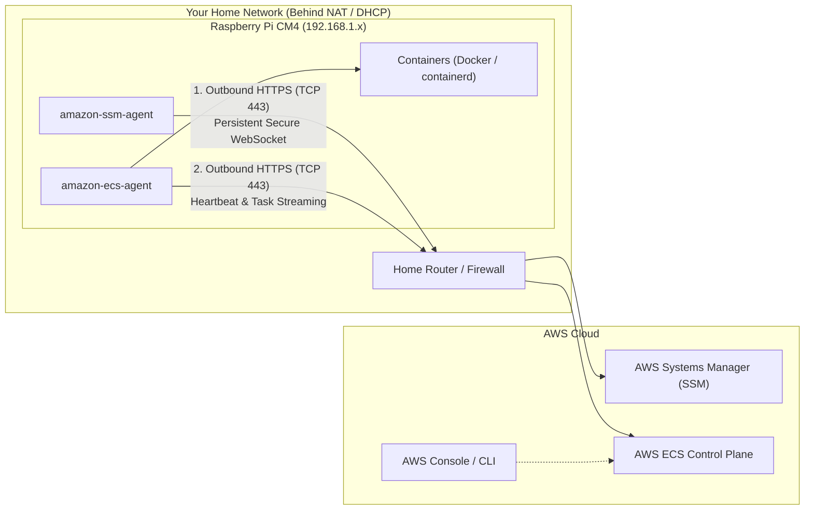

# AWS Hybrid Cloud Integration & Feasibility Analysis (RPi CM4 Cluster)

This document summarizes the architectural feasibility, networking mechanics, pricing models, and implementation steps for connecting the 6-node Raspberry Pi Compute Module 4 (CM4) cluster to Amazon Web Services (AWS).

---

## 1. Executive Summary & Technology Comparison

| Solution | Supported on CM4? | Operational Viability | Primary Use Case / Verdict |
| :--- | :---: | :---: | :--- |
| **Amazon EKS Anywhere (Bare Metal)** | **No** | Incompatible | **Not viable.** Exceeds 4 GB RAM capacity; requires enterprise IPMI/Redfish BMC and UEFI PXE infrastructure. |
| **Amazon ECS Anywhere** | **Yes** | **Optimal** | **Officially supported on ARM64.** Lightweight (~128 MB RAM); runs under AWS Free Tier; zero router configuration. |
| **Amazon EKS Connector** | **Yes** | **High** | Connects the current **K3s cluster** to the AWS EKS Console for centralized visualization. |

---

## 2. Why Amazon EKS Anywhere (EKS-A) Is Not Supported

Amazon EKS Anywhere Bare Metal is engineered for enterprise datacenter platforms (Dell, HPE, Cisco) and cannot run reliably on 4 GB CM4 hardware due to four hard architectural constraints:

1. **Severe Memory Deficit (4 GB vs. 8–16 GB Minimum):**
   * EKS-A runs full upstream Kubernetes (EKS-D) with standalone `kube-apiserver`, `etcd`, and **Cilium CNI**.
   * Idle memory demand exceeds ~3.5 GB, causing immediate Out-of-Memory (OOM) kernel panics on 4 GB CM4 nodes (3.7 GiB usable).
2. **Missing BMC / Out-of-Band Hardware Management:**
   * EKS-A Bare Metal automates provisioning via **Tinkerbell** (`CAPX`), which mandates a **Baseboard Management Controller (BMC)** supporting **IPMI** or **Redfish** protocols (e.g., iDRAC, iLO).
   * Raspberry Pi CM4 carrier boards do not have an IPMI/Redfish BMC to remotely cycle power and force network PXE boot.
3. **Proprietary Bootloader vs. Enterprise UEFI/ACPI:**
   * EKS-A expects standard UEFI/ACPI PXE netbooting. Raspberry Pi uses proprietary GPU-staged firmware (`start4.elf`, `config.txt`).
4. **Cluster API (CAPI) Management Overhead:**
   * EKS-A uses a dual-cluster architecture (Management Cluster + Workload Cluster) that would exhaust cluster resources before user workloads could be scheduled.

---

## 3. Amazon ECS Anywhere: Architecture & Networking

Amazon ECS Anywhere officially supports Linux ARM64 hardware (including Raspberry Pi CM4). It separates the control plane (hosted by AWS) from the compute plane (running on your on-premises edge appliances).

### The Outbound-Only Connection Model

AWS **never initiates an inbound connection** to your home network. You do **not** need:
* Router port forwarding
* A public static IP or Dynamic DNS (DDNS)
* A VPN tunnel



### How DHCP and Dynamic Home IPs Are Handled
* **Instance ID Identity:** AWS does not track nodes by IP address or hostname. Each node receives a permanent **Systems Manager Managed Instance ID** (e.g., `mi-09f8e7d6c5b4a3210`).
* **Dynamic IP Resiliency:** If your home DHCP changes a node's local IP (e.g., from `192.168.1.138` to `192.168.1.145`), the agent simply reports the updated IP during its next heartbeat over the open outbound connection. Connectivity is never dropped.

---

## 4. Cost & Pricing Breakdown

AWS provides a **permanent Free Tier** specifically for ECS Anywhere:

* **Free Tier Allowance:** **2,200 instance-hours free per month** per AWS account (perpetual, not limited to the first year).
* **Above Free Tier:** **$0.01025 per hour** per connected instance (billed in 1-second increments).

### Monthly Cost Scenarios (Based on 720 hours/month)

| Deployment Scenario | Monthly Instance Hours | Free Tier Applied | Billable Hours | Total Monthly Cost |
| :--- | :--- | :--- | :--- | :--- |
| **3 CM4 Nodes running 24/7** | 3 × 720 = **2,160 hrs** | 2,160 hrs | **0 hrs** | **$0.00 / month (100% Free)** |
| **All 6 Nodes for Lab Testing (~350 hrs/mo)** | 6 × 350 = **2,100 hrs** | 2,100 hrs | **0 hrs** | **$0.00 / month (100% Free)** |
| **All 6 Nodes running 24/7** | 6 × 720 = **4,320 hrs** | 2,200 hrs | **2,120 hrs** | **~$21.73 / month** |

### Ancillary AWS Service Costs
* **AWS Systems Manager (SSM):** **$0.00** (Standard on-premises tier is free for up to 1,000 servers).
* **Amazon ECR (Container Registry):** 500 MB private storage free/month (or pull free public images from Docker Hub / GitHub Container Registry).
* **Amazon CloudWatch Logs:** 5 GB log ingestion and 5 GB storage free/month.

---

## 5. Quick-Start Setup Runbook for ECS Anywhere

### Step 1: Create IAM Roles in AWS
1. **`ecsAnywhereRole`** (Trusts `ssm.amazonaws.com`):
   * Attach managed policies: `AmazonEC2ContainerServiceforEC2Role` and `AmazonSSMManagedInstanceCore`.
2. **`ecsTaskExecutionRole`**:
   * Attach managed policy: `AmazonECSTaskExecutionRolePolicy`.

### Step 2: Create ECS Cluster
1. Open the **Amazon ECS Console**.
2. Click **Create Cluster**, name it (e.g., `cm4-edge-cluster`).
3. Under **Infrastructure**, enable **External instances**.

### Step 3: Generate Registration Activation
In the ECS cluster dashboard:
1. Navigate to **Infrastructure** → **Register External Instances**.
2. Select **Linux** and **ARM64**.
3. AWS will generate an Activation Code, Activation ID, and a pre-formatted registration command.

### Step 4: Execute Registration on CM4
Run the automated installation script on the node:
```bash
curl --proto "https" -o "/tmp/ecs-anywhere-install.sh" "https://amazon-ecs-agent.s3.amazonaws.com/ecs-anywhere-install.sh"
sudo bash /tmp/ecs-anywhere-install.sh \
    --region "YOUR_AWS_REGION" \
    --cluster "cm4-edge-cluster" \
    --activation-id "YOUR_ACTIVATION_ID" \
    --activation-code "YOUR_ACTIVATION_CODE"
```

### Step 5: Verification & Task Deployment
* The node will register in the ECS Console within ~30 seconds as an `EXTERNAL` instance showing `4 vCPU / 3.7 GiB RAM` and `arm64` architecture.
* Tasks are deployed by creating standard ECS Task Definitions using **Launch Type: EXTERNAL**.
