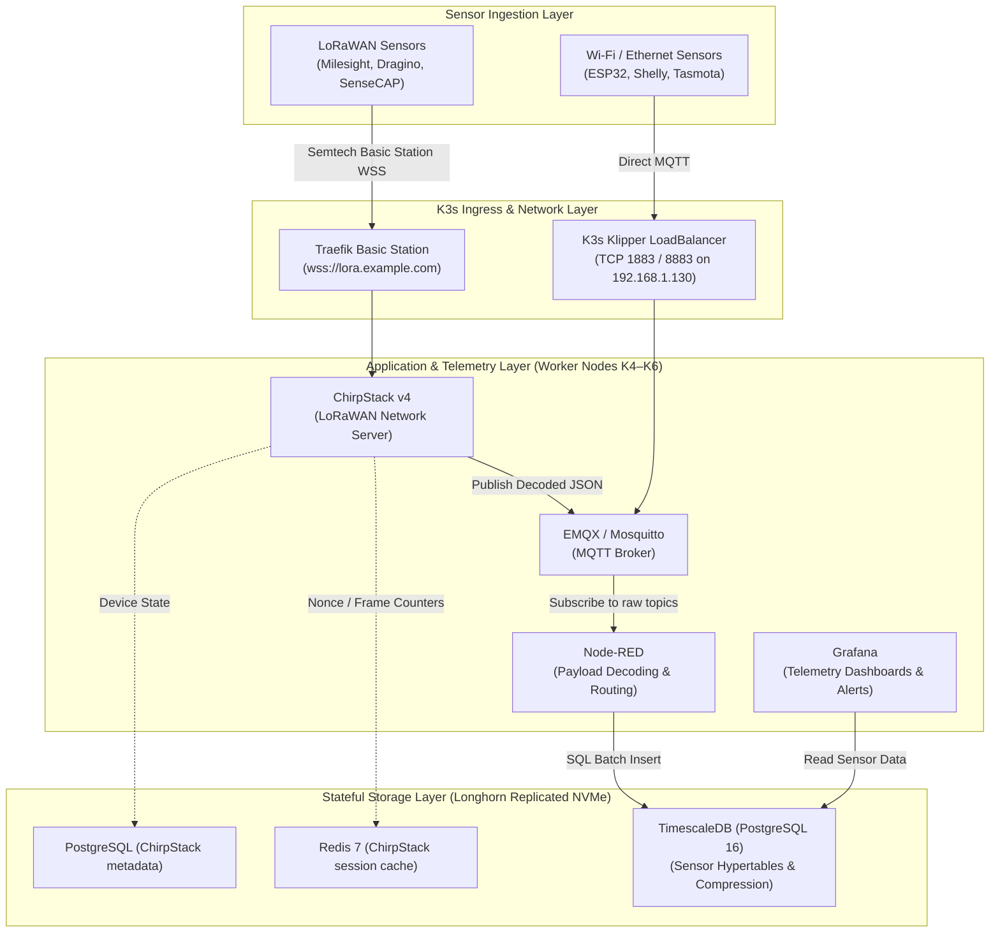
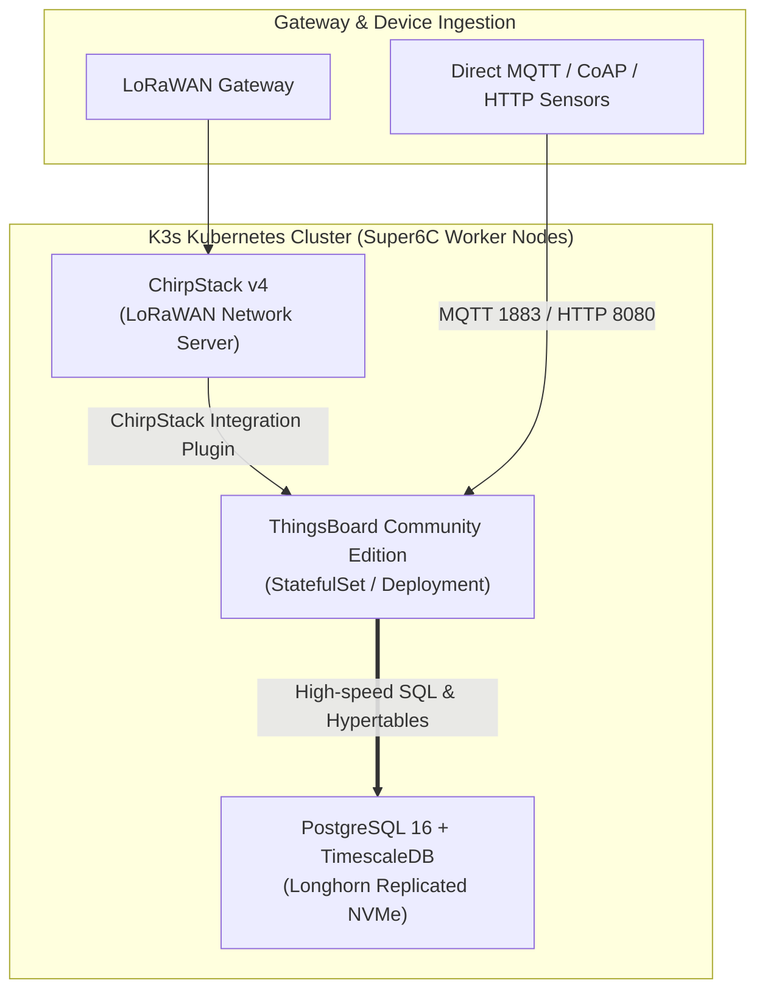

# IoT, LoRaWAN, MQTT & Telemetry Architecture Guide
## Deploying Sensor Ingestion, Message Brokers, and Time-Series Visualization on K3s

**Date:** 2026-09-12  
**Target Cluster:** 6x Raspberry Pi CM4 (DeskPi Super6C 6-Node ARM64 Cluster)  
**Supported Protocols:** LoRaWAN 1.0.x / 1.1.x, MQTT / MQTTS (TCP 1883/8883), Basic Station (WSS), HTTP/Webhooks  

---

## 1. Executive Summary & Application Comparison

Deploying an industrial-grade IoT telemetry pipeline into Kubernetes requires balancing **protocol handling** (MQTT, UDP, WebSockets), **compute constraints** (4GB RAM on ARM64 CM4 nodes), and **I/O throughput** (high-frequency writes to SSDs).

The IoT ecosystem evaluates across four functional layers:
1. **LoRaWAN Core**: Network & Application Server managing gateways, device joins, and cryptographic session keys.
2. **Message Ingestion**: High-throughput MQTT brokers distributing sensor messages across topics.
3. **Payload Processing & Rule Chains**: Decoding raw sensor payloads (hex/base64 to JSON) and routing alerts.
4. **Time-Series Storage & Dashboards**: Storing billions of timestamped sensor data points and rendering interactive graphs.

### Comprehensive Application Suitability Matrix

| Application | Primary Function | K8s Deployment Ease | Memory Footprint | Architecture Support | Cluster Tier Placement | Evaluation Verdict |
| :--- | :--- | :--- | :--- | :--- | :--- | :--- |
| **ChirpStack v4** | LoRaWAN Network & App Server | ⭐⭐⭐⭐⭐ **Very Easy** (Helm / K8s Manifests) | **Ultra-Light** (~50–150 MB, Rust/Go) | ✅ Native ARM64 | **Worker Nodes (K4–K6)**<br/>DB on Longhorn NVMe | **Primary Choice for LoRaWAN**. Extremely fast, minimal resource consumption, native PostgreSQL/Redis backend. |
| **ThingsBoard CE** | Turnkey IoT Portal (Devices, Rules, Graphs) | ⭐⭐⭐⭐☆ **Moderate** (Official Helm Chart) | **Heavy** (~1.5–3.0 GB, Java JVM) | ✅ Native ARM64 | **Worker Nodes (K4–K6)**<br/>DB on Longhorn NVMe | **Best All-in-One Solution**. Out-of-the-box widgets, centralized device/asset management, automated irrigation rule engine, and RPC device downlinks. Requires dedicated pod memory limits. |
| **The Things Stack (TTS / TTN)** | LoRaWAN Network Server | ⭐⭐☆☆☆ **Complex** (Multi-service microservices) | **Medium-High** (~1.0–2.0 GB, Go) | ✅ Native ARM64 | **Worker Nodes (K4–K6)** | Overly complex for compact edge / enterprise clusters unless public TTN peering is strictly required. |
| **Eclipse Mosquitto** | Lightweight MQTT Broker | ⭐⭐⭐⭐⭐ **Trivial** (Single Pod / Helm) | **Ultra-Light** (<30 MB, C) | ✅ Native ARM64 | **Worker Nodes (K4–K6)** | **Ideal standard MQTT broker** for low-to-medium volume sensor ingestion (<10,000 msgs/sec). |
| **EMQX** | Clustered Distributed MQTT Broker | ⭐⭐⭐⭐☆ **Easy** (Official K8s Operator) | **Medium** (~250–500 MB, Erlang) | ✅ Native ARM64 | **Worker Nodes (K4–K6)** | **Best for High Availability**. Features native clustering, web UI, built-in SQL rule engine, and data bridges. |
| **Node-RED** | Visual Pipeline & Payload Decoder | ⭐⭐⭐⭐⭐ **Very Easy** (Deployment / Helm) | **Light** (~150–300 MB, Node.js) | ✅ Native ARM64 | **Worker Nodes (K4–K6)** | **Essential Middleware**. Converts arbitrary vendor binary/hex sensor payloads into clean JSON formats. |
| **TimescaleDB** | Time-Series Relational Storage | ⭐⭐⭐⭐⭐ **Easy** (CloudNativePG / Manifests) | **Flexible** (~1.0–2.5 GB buffer cache) | ✅ Native ARM64 | **Worker Nodes (Longhorn NVMe)** | **Gold Standard Storage**. PostgreSQL 16 hypertable engine with 90%+ columnar compression and continuous aggregates. |
| **Grafana** | Telemetry Visualization & Alerting | ⭐⭐⭐⭐⭐ **Trivial** (Mature Helm Chart) | **Light** (~150–250 MB, Go) | ✅ Native ARM64 | **Worker Nodes (K4–K6)** | **Gold Standard Dashboards**. Fast rendering, deep PostgreSQL/TimescaleDB/MQTT plugin support, alert routing. |

### End-to-End Field-to-Cloud Telemetry Architecture

The diagram below illustrates the end-to-end edge telemetry ingestion pipeline—from precision viticulture field sensors (transmitting via sub-GHz LoRaWAN RF) to an outdoor gateway, forwarded across local Wi-Fi to the DeskPi Super6C K3s cluster (ChirpStack v4 and ThingsBoard CE), with Starlink or cellular multi-WAN uplink connectivity:


---

## 2. Recommended Architecture Blueprints

### Blueprint A: The High-Performance Modular Telemetry Engine (Recommended)
*Best for maximum modularity, sub-second dashboard updates, and low memory consumption on CM4 nodes.*



#### Why Blueprint A Excels in this Environment:
1. **Low Footprint on CM4s**: ChirpStack v4 (Rust) and Mosquitto/EMQX consume less than 300MB of RAM combined.
2. **Dedicated NVMe High-Speed I/O**: Direct PCIe Gen 2 M.2 NVMe storage eliminates disk I/O bottlenecks for time-series indexing, disk flushes, and columnar compression.
3. **Decoupled Payload Decoding**: Sensor firmware differences are handled visually in Node-RED without recompiling or redeploying code.

---

### Blueprint B: The Turnkey IoT Platform (ThingsBoard CE)
*Best for property-wide deployments requiring centralized asset and device management, automated irrigation rule chains, remote device downlinks (RPC), and built-in widget dashboards.*



#### Key Considerations for ThingsBoard on CM4:
* **JVM Heap Sizing**: Configure `JAVA_OPTS="-Xms1024m -Xmx2048m"` in the pod specification to prevent Out-Of-Memory (OOM) kills on the 4GB CM4 nodes.
* **Database Decoupling**: Do not run ThingsBoard's default monolithic bundled database inside the application container; deploy PostgreSQL 16 + TimescaleDB backed by Longhorn distributed NVMe storage with proper connection pooling and memory limits.

---

## 3. Kubernetes Ingress & Networking for IoT Protocols

Standard Kubernetes ingress controllers (like Traefik or NGINX) are designed for HTTP/HTTPS. IoT systems require specific handling for **MQTT (TCP)**, **Semtech Packet Forwarder (UDP)**, and **LoRaWAN Basic Station (WebSockets)**.

### 1. MQTT Ingress (TCP Port 1883 & 8883)
To allow external microcontrollers and local smart sensors to publish to your broker without HTTP headers:
* **Recommended Approach**: Use K3s native Klipper LoadBalancer or a Kubernetes `NodePort` service mapped to your control plane VIP (`192.168.1.130:1883`).
* **Example Kubernetes Service Manifest**:
  ```yaml
  apiVersion: v1
  kind: Service
  metadata:
    name: mosquitto-lb
    namespace: iot
  spec:
    type: LoadBalancer
    selector:
      app: mosquitto
    ports:
      - name: mqtt-plain
        port: 1883
        targetPort: 1883
      - name: mqtt-tls
        port: 8883
        targetPort: 8883
  ```

### 2. LoRaWAN Gateway Connectivity: Basic Station vs. UDP Packet Forwarder

| Gateway Protocol | Transport | Port | Kubernetes Routing Method | Security / Reliability |
| :--- | :--- | :--- | :--- | :--- |
| **LoRaWAN Basic Station** *(Modern Standard)* | WebSockets over TLS (`wss://`) | `443` | **Standard Traefik IngressRoute**. Routed like standard HTTPS web traffic with automated Let's Encrypt certificates (`wss://lora.example.com`). | **High**: Encrypted, authenticated, auto-reconnecting, traverses firewalls easily. |
| **Semtech Packet Forwarder** *(Legacy)* | Raw UDP | `1700` | Requires `hostPort: 1700` or Klipper LoadBalancer UDP mode. Ingress controllers cannot inspect UDP packets. | **Low**: Plaintext, stateless UDP, prone to dropped packets over WAN. |

> [!TIP]
> **Use Basic Station for All Gateways**: Configure your LoRaWAN gateways (e.g., Dragino LPS8, RAKwireless WisGate, MikroTik wAP LR) to use **Basic Station (LNS mode)** pointing to `wss://lora.example.com`. This completely eliminates the need for brittle UDP port forwarding on your router.

---

## 4. Storage & Retention Strategy (Hypertables)

IoT time-series data grows rapidly. A cluster monitoring 100 sensors transmitting every 10 seconds generates:

> **Daily Volume Calculation**: `(100 sensors × 86,400 sec/day) ÷ 10 sec interval` = **864,000 data points / day** (~**26 Million rows / month**)

### TimescaleDB Optimization on High-Speed NVMe Storage
1. **Hypertables**: Partition tables automatically by timestamp into 7-day chunks.
2. **Columnar Compression**: TimescaleDB compresses historical chunks (older than 7 days) by up to **92%**, reducing 26 million rows to <250 MB of disk space.
3. **Continuous Aggregates**: Automatically downsamples historical data into 1-hour and 1-day averages for fast multi-year Grafana queries.
4. **Data Retention Policy**: Automatically drop raw point data after 90 days while preserving hourly downsampled averages indefinitely.

---

## 5. Deployment Roadmap for K3s

```text
Step 1: Database Setup (Longhorn Replicated NVMe)
  ├── Deploy CloudNativePG or PostgreSQL 16 container with TimescaleDB extension
  └── Deploy Redis 7 for ChirpStack session state and deduplication
Step 2: MQTT Broker (CM4 Workers)
  ├── Deploy Eclipse Mosquitto or EMQX via Helm
  └── Expose Port 1883 via LoadBalancer on VIP (192.168.1.130)
Step 3: LoRaWAN Core (CM4 Workers)
  ├── Deploy ChirpStack v4 and ChirpStack Gateway Bridge
  └── Create Traefik IngressRoute for Web UI and Basic Station (wss://lora.example.com)
Step 4: Middleware & Transformation (CM4 Workers)
  ├── Deploy Node-RED with Longhorn persistent storage for flows
  └── Configure payload decoder functions for active LoRaWAN sensor codecs
Step 5: Visualization & Alerting (CM4 Workers)
  ├── Deploy Grafana via official Helm chart (grafana/grafana)
  ├── Add TimescaleDB as PostgreSQL data source
  └── Build real-time temperature, environmental, and battery health dashboards
```

---

## 6. Blueprint A Scalability & Sizing Analysis (Commercial Fleet Case Study)

To evaluate the operational capacity of the cluster, we examine an enterprise-scale commercial agricultural workload (e.g., across 200 monitoring zones / vineyard blocks):
* **Payload Size Baseline**: **115-byte** binary packet per transmission (encapsulating ~25 multi-depth SDI-12 soil moisture/temperature, microclimate, battery/solar metrics, and health flags).
* **Ingestion Cadence**: Transmitting every **5 minutes (300s)** as the primary high-resolution monitoring cadence, with an **optional 15-minute (900s)** power-optimized / conservative telemetry profile.
* **Commercial Fleet Baseline**: **4,000 active sensors** generating rich telemetry across 200 vineyard blocks (20 sensors per block).

### 6.1. Workload Calculations: 5-Minute vs. Optional 15-Minute Cadence

| Metric Dimension | Single Zone (20 Sensors) @ 5m | Single Zone (20 Sensors) @ 15m | Full Fleet (4,000 Sensors) @ 5m | Full Fleet (4,000 Sensors) @ 15m |
| :--- | :---: | :---: | :---: | :---: |
| **Active Sensor Count** | 20 sensors | 20 sensors | **4,000 sensors** | **4,000 sensors** |
| **Transmit Cadence** | Every 5 min (300s) | Every 15 min (900s) | Every 5 min (300s) | Every 15 min (900s) |
| **Packets / Day / Sensor** | 288 packets | 96 packets | 288 packets | 96 packets |
| **Uplink Ingestion Rate** | 0.067 msgs/sec | 0.022 msgs/sec | **13.33 msgs/sec** | **4.44 msgs/sec** |
| **Metric Ingestion Rate (~25 metrics/pkt)** | 1.67 metrics/sec | 0.56 metrics/sec | **333.33 metrics/sec** | **111.11 metrics/sec** |
| **Daily Telemetry Volume** | 144,000 data points | 48,000 data points | **28,800,000 data points** | **9,600,000 data points** |
| **Monthly Telemetry Volume** | 4,320,000 data points | 1,440,000 data points | **864,000,000 data points** | **288,000,000 data points** |
| **Annual Raw Payload Volume (115B)** | ~241.8 MB | ~80.6 MB | **~48.36 GB / year** | **~16.12 GB / year** |

### 6.2. Resource Bottleneck Analysis Across Tiers

1. **Stateful Database Tier (Longhorn Replicated NVMe)**:
   * **Write Throughput**: TimescaleDB on direct PCIe Gen 2 NVMe ingests 15,000 to 25,000 writes/sec. Even at the 5-minute peak rate of 333.3 metrics/sec, this consumes **<2% of database write capacity** (dropping to **<0.7%** at 15-minute intervals).
   * **Storage Footprint**: TimescaleDB columnar compression reduces rows to ~4 bytes/metric (~19 bytes per 115-byte packet):
     * **5-Minute Cadence**:
       * Monthly Storage: `864M data points × 4 bytes` ≈ **~3.45 GB / month** (~666 MB/month compressed chunk storage).
       * Annual Storage: **~41.5 GB / year** (~8.0 GB/year compressed hypertable storage).
       * **Storage Verdict**: In a 200–250 GB NVMe partition, provides **~25 to 30 years of continuous unpurged historical data**.
     * **Optional 15-Minute Cadence**:
       * Monthly Storage: `288M data points × 4 bytes` ≈ **~1.15 GB / month** (~222 MB/month compressed chunk storage).
       * Annual Storage: **~13.8 GB / year** (~2.66 GB/year compressed hypertable storage).
       * **Storage Verdict**: Provides **~75 to 90 years of continuous historical retention** on the same volume.
2. **Tier 2 (Application Workers - CM4 4GB Nodes)**:
   * **Streamlined Single Ingestion Pipeline**: ChirpStack v4, EMQX, and shared Node-RED routing handle 13.3 msgs/sec (5-min) or 4.4 msgs/sec (15-min) with **<5% CPU and <300MB RAM combined**. This provides massive headroom for additional sensors or higher sampling frequencies.
   * **Resource Allocation**: Application pods require under 1.5 GB RAM total, leaving ample capacity on the 3 worker nodes (~7.5 GB allocatable RAM) for auxiliary services, ThingsBoard, and alerting engines.
3. **Physical LoRaWAN RF Airtime (Gateway Limit)**:
   * For 115-byte physical payloads at SF7 (~190ms ToA) or SF8 (~340ms ToA):
     * **5-Minute Cadence**: A single 8-channel gateway reliably supports up to ~2,000 sensors (<8% packet collisions). A 4,000-sensor fleet requires **2 physical 8-channel gateways** to distribute RF channel load and ensure geographic coverage across vineyard blocks.
     * **Optional 15-Minute Cadence**: Because airtime demand drops by $3\times$, a single 8-channel gateway can support **up to 4,000–5,000 sensors** with packet collision rates staying under 5%!
   * *For detailed mathematical modeling of ALOHA packet collisions, FCC 400ms dwell time compliance, and 115-byte payload retention on NVMe across 500, 2,000, and 4,000 sensors (at both 5-min and optional 15-min intervals), refer to [`docs/LORAWAN_CAPACITY_AND_STORAGE_ANALYSIS.md`](LORAWAN_CAPACITY_AND_STORAGE_ANALYSIS.md).*

---

## 7. Cloud Footprint & Cost Comparison (Commercial Fleet on AWS vs. On-Premises Edge)

To provision equivalent enterprise infrastructure in Amazon Web Services (US East, On-Demand):

### 7.1. Option A: Self-Hosted on AWS EKS (Equivalent Cloud Architecture)
* **EKS Control Plane**: Redundant managed Kubernetes master ($73.00/mo)
* **Application & Database Nodes**: 3x `t4g.medium` Graviton2 ARM64 (6 vCPU, 12 GB RAM total) ($95.20/mo)
* **Persistent Storage**: 3x 250 GB gp3 EBS Volumes (750 GB total, 3,000 IOPS) ($60.00/mo)
* **Load Balancers & Ingress**: 1x NLB (MQTT TCP) + 1x ALB (HTTPS WSS) ($42.50/mo)
* **Networking**: 2x NAT Gateways (HA) + Inter-AZ data replication ($100.70/mo)
* **Total AWS EKS Cost**: **~$371.40 / month** ($\mathbf{\$4,456.80 \text{ / year}}$)

### 7.2. Option B: AWS Native Managed Services (Serverless)
* **AWS IoT Core**: Connectivity for 4,000 devices + 34.56M messages + Rules engine ($53.56/mo)
* **Amazon RDS PostgreSQL (Multi-AZ)**: `db.m6g.xlarge` + 1TB gp3 ($372.50/mo)
* **Amazon Managed Grafana**: 5 Editors ($9/ea) + 20 Viewers ($4/ea) ($125.00/mo)
* **NAT Gateways, Transfer & CloudWatch**: ($110.70/mo)
* **Total AWS Native Cost**: **~$661.76 / month** ($\mathbf{\$7,940.00 \text{ / year}}$)

### 7.3. Critical Cloud Cost Traps Exposed
* **Amazon Timestream Write Fees**: Timestream charges $0.50 per million writes. At 864M metrics/month, write fees alone would cost **$432.00/month** before storage.
* **Grafana Per-User Viewing Fees**: AWS Managed Grafana charges $4.00/user/month and $9.00/editor/month, whereas self-hosted Grafana has **$0 (100% free)** user licensing.
* **The "Idle Tax"**: AWS EKS, NAT gateways, and load balancers cost **~$180–$220/month** even with zero connected sensors.

### 7.4. Financial TCO Comparison

| Dimension | AWS Cloud (EKS or Native) | DeskPi Super6C 6-Node Edge Cluster |
| :--- | :--- | :--- |
| **Monthly Operating Cost** | **$370.00 to $660.00+ / month** | **~$2.70 – $3.75 / month** *(electricity @ $0.15/kWh)* |
| **Annual Operating Cost** | **$4,440.00 to $7,920.00+ / year** | **~$32.40 – $45.00 / year** |
| **Storage Performance** | Network EBS capped at 3,000 IOPS | Direct PCIe Gen 2 NVMe (**50,000+ native IOPS**) |
| **User / Operator Licensing** | $4.00 to $9.00 / user / month | **Unlimited Users ($0)** |
| **Data Sovereignty** | Public Cloud | **100% On-Premises / Air-Gappable** |

---

## 8. Internet Bandwidth & ISP Network Requirements

Because IoT telemetry payloads are compact, supporting the 4,000-sensor commercial fleet consumes minimal WAN bandwidth.

### 8.1. Inbound Telemetry Ingestion (Download Bandwidth)
* **Frequency**: 4,000 messages every 300 seconds = **13.33 messages / second**
* **Wire Payload** (TCP framing, TLS record encryption, and JSON wrapper): ~**1.0 KB / message**

> **Continuous Ingestion Bandwidth**: `13.33 msgs/sec × 1.0 KB` = **13.33 KB/sec** (**106.7 Kbps** ≈ **~0.11 Mbps**)

* Even during a **5x network jitter burst**, peak ingestion consumes only **~0.53 Mbps**.

### 8.2. Outbound Dashboard Access (Upload Bandwidth)
Web dashboards (Grafana) consume Internet **Upload speed** from your edge appliance:
* **Initial Page Load**: Static JS/CSS/fonts bundle (~2.5 MB, loaded once and browser-cached).
* **Query Polling**: Time-series JSON payload per refresh cycle (~30 KB to 50 KB).

| Concurrent Dashboard Operators | Dashboard Refresh Cycle | Sustained Upload Speed | Burst Upload (Initial Page Loads) |
| :--- | :--- | :--- | :--- |
| **10 Active Users** (Normal) | Every 30 seconds | **~0.10 Mbps** | ~5 Mbps |
| **30 Active Users** (Busy) | Every 30 seconds | **~0.32 Mbps** | ~15 Mbps |
| **50 Active Users** (Peak) | Every 10 seconds | **~2.00 Mbps** | ~25 Mbps |

### 8.3. Recommended ISP Connection

| Connection Type | Typical Speeds | Suitability for Commercial Fleet |
| :--- | :--- | :--- |
| **Fiber (FTTH)** | 100/100 to 1Gbps/1Gbps | **Optimal (Overkill)**. Sub-5ms latency, symmetrical bandwidth handles dozens of concurrent dashboard users. |
| **Standard Cable** | 300 Mbps Down / 15–20 Mbps Up | **Sufficient**. Flawless sensor ingestion. 15+ concurrent dashboard page loads may exhibit 1–2 second initial load latency. |
| **Starlink / Cellular / Fixed Wireless** | 50–220 Mbps Down / 10–25 Mbps Up | **Viable**, provided latency jitter is acceptable. Excellent for remote agricultural sites. |

### 8.4. Bandwidth Optimization Best Practices
1. **Edge CDN Caching (Cloudflare Free Tier)**:
   * Proxies `example.com` at the Cloudflare edge. All static assets (Grafana JS, CSS, images) are served from Cloudflare's global edge cache.
   * Your edge appliance uplink serves **only raw JSON query responses**, reducing upload traffic by **~75%**.
2. **Dashboard Polling Interval Tuning**:
   * Set default Grafana dashboard refresh to **1 minute or 5 minutes** (matching the 5-minute sensor transmission interval).
   * Prevents wasteful polling loops and reduces database queries and outbound traffic by **80%**.


