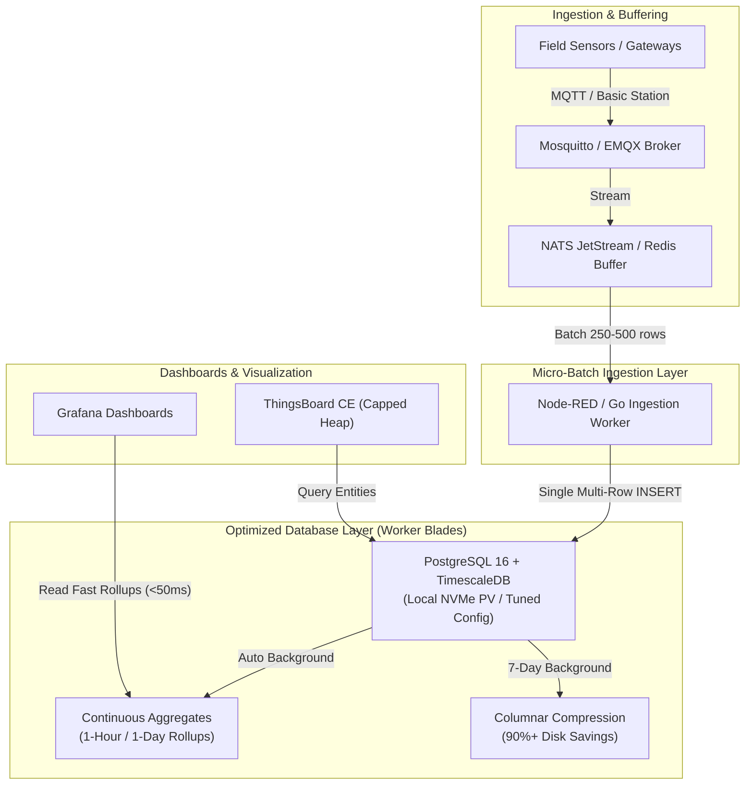

# Phase 2: Database Performance Analysis & Mitigation Guide
## Deploying ChirpStack v4, ThingsBoard CE & TimescaleDB on a Single 6-Blade DeskPi Super6C Cluster

**Date:** 2026-09-13  
**Cluster Architecture:** 1x DeskPi Super6C Mini-ITX (6x Raspberry Pi CM4 4GB / 250GB NVMe)  
**Target Workloads:** ChirpStack v4, ThingsBoard Community Edition, PostgreSQL 16 + TimescaleDB, Redis 7, NATS / EMQX  
**Operating Footprint:** Pure ARM64 Edge Appliance (~20W idle / ~45W peak)  

---

## 1. Executive Summary & Context

As part of **Phase 2**, the cluster hosts the complete IoT and telemetry stack directly on the 6-blade **DeskPi Super6C** without external database servers. This delivers an autonomous, low-power edge appliance suitable for remote field stations (vineyards, industrial plants, microgrids) capable of operating on solar/battery power.

Running high-volume stateful database engines (PostgreSQL 16, TimescaleDB) and JVM-based platforms (ThingsBoard CE) on compact ARM64 compute modules requires proactive performance engineering. This document details the physical constraints, identified performance bottlenecks, and verified mitigation strategies to achieve enterprise-grade reliability and high ingestion throughput.

```text
┌────────────────────────────────────────────────────────────────────────────────────────┐
│                     SUPER6C WORKLOAD PLACEMENT & STORAGE TOPOLOGY                      │
├────────────────────────────────────────────────────┬───────────────────────────────────┤
│ CONTROL PLANE BLADES (Isolated etcd Quorum)        │ WORKER BLADES (Compute & Storage) │
│ • Blade K1: kube-1 (etcd leader / API Server)      │ • Blade K4: ChirpStack + EMQX     │
│ • Blade K2: kube-2 (etcd follower / API Server)    │ • Blade K5: ThingsBoard + Redis   │
│ • Blade K3: kube-3 (etcd follower / API Server)    │ • Blade K6: TimescaleDB / DB Mesh │
│ Dedicated NVMe: OS + Local etcd WAL only           │ Dedicated NVMe: Longhorn / LocalPV│
└────────────────────────────────────────────────────┴───────────────────────────────────┘
```

---

## 2. Physical Edge Hardware Constraints

| Hardware Dimension | Specification per Compute Module | Cluster Total (6 Blades) | Operational Implication |
| :--- | :--- | :--- | :--- |
| **System Memory** | **4 GB LPDDR4** (soldered, non-expandable) | **24 GB RAM** | System overhead (OS, `k3s`, `containerd`, Longhorn CSI) consumes ~1.1 GB. Net allocatable RAM on worker compute modules is **~2.5–2.8 GB per compute module**. |
| **CPU Silicon** | **Broadcom BCM2711** (Quad-Core Cortex-A72 @ 1.5 GHz) | **24 Cores** | ARMv8 64-bit out-of-order execution; lower single-threaded IPC than desktop x86; sensitive to heavy JIT compilation. |
| **Local Storage** | **250 GB M.2 NVMe SSD** (PCIe Gen 2 x1) | **1.5 TB NVMe** | Dedicated PCIe bus yields ~400–450 MB/s sequential and **50,000+ random IOPS**; zero SD card reliability risks. |
| **Network Backplane**| **Onboard 1 Gbps Switch IC** | **1 Gbps East-West** | Interconnects all 6 blades at wire speed across PCB traces; physical ceiling for distributed storage replication. |
| **Power & Thermal** | ~3.5W idle, ~7.5W peak per compute module | **~20W idle, ~45W peak** | Dual active PWM fans keep module temperatures <55°C to avoid CPU thermal throttling (starts at 80°C). |

---

## 3. Key Performance Impacts & Identified Bottlenecks

### 3.1. Memory Pressure & Out-Of-Memory (OOM) Risk
* **Constraint**: 4 GB RAM per worker node.
* **Impact**: 
  * ThingsBoard CE runs on a Java Virtual Machine (JVM) that can easily consume 2.0–3.0 GB of memory if unconstrained.
  * PostgreSQL defaults that assume 16GB+ systems will allocate excessive buffer pools (`shared_buffers`) and sort memory (`work_mem`).
  * If memory exceeds 4GB on a worker blade, the Linux kernel OOM killer terminates critical pods (e.g., PostgreSQL, Longhorn engine, or K3s agent).

### 3.2. Storage Latency & Write Amplification
* **Constraint**: Longhorn 3-way synchronous block replication across the 1 Gbps backplane.
* **Impact**:
  * Every synchronous disk flush (`fsync` / WAL write) must travel across the gigabit backplane to all 3 worker drives before the database transaction is acknowledged.
  * Local NVMe commit latency is **~0.02 ms**, while network-replicated Longhorn commit latency is **~0.8–1.5 ms**.
  * **Double Replication Trap**: If a clustered database (e.g., CloudNativePG streaming replication or Redis Sentinel) is placed on top of Longhorn 3-way replicated volumes, write amplification becomes **6x** (2 DB instances × 3 storage replicas), wasting network bandwidth and drive endurance.

### 3.3. CPU IPC & Single-Thread Saturation
* **Constraint**: Cortex-A72 @ 1.5 GHz single-core execution speed.
* **Impact**:
  * In PostgreSQL 16, Just-In-Time (JIT) compilation evaluates queries using LLVM. On ARM Cortex-A72 cores, the CPU overhead of compiling the query plan often takes longer than the actual query execution time.
  * Complex analytical queries with table scans can monopolize a core at 100%, causing query queuing and API latency spikes.

### 3.4. Control Plane `etcd` Quorum Interference
* **Constraint**: `etcd` relies on sub-10ms disk write latency to maintain Raft consensus.
* **Impact**:
  * If database workloads are scheduled on control plane blades (`kube-1`–`kube-3`), heavy disk I/O bursts or memory contention can delay `etcd` heartbeat writes, triggering leader elections and cluster-wide flapping.

---

## 4. Comprehensive Mitigation Strategies



### 4.1. PostgreSQL 16 & TimescaleDB Parameter Tuning

Deploy PostgreSQL with an optimized `postgresql.conf` specifically calibrated for 4GB CM4 blades:

```ini
# Memory Configuration (Tuned for 4GB CM4 Blade)
shared_buffers = 384MB                  # 15% of allocatable RAM; preserves room for OS & page cache
work_mem = 8MB                          # Safe limit per sort/hash operation
maintenance_work_mem = 64MB             # Memory for VACUUM, CREATE INDEX, and hypertable chunks
effective_cache_size = 1536MB           # Informs query planner of available Linux page cache
max_connections = 60                    # Cap direct connections; use PgBouncer for client scaling

# ARM64 Cortex-A72 Architecture Tuning
jit = off                               # CRITICAL: Disable JIT compilation to eliminate CPU spikes
max_parallel_workers_per_gather = 2     # Prevent a single query from consuming all 4 CPU cores
max_parallel_maintenance_workers = 2    # Balanced background vacuuming

# WAL & Disk Flush Optimization (Mitigates Network Storage Latency)
synchronous_commit = off                # Asynchronous commit: transactions return immediately;
                                        # WAL flushes in background batches (sub-second window)
commit_delay = 100                      # Delay commit by 100 microseconds to group transactions
commit_siblings = 5                     # Minimum concurrent transactions before commit_delay triggers
wal_buffers = 16MB                      # Buffer WAL in memory before disk write
checkpoint_completion_target = 0.9      # Spread checkpoint I/O over time to prevent write spikes
min_wal_size = 512MB
max_wal_size = 2GB
```

> [!IMPORTANT]
> **Asynchronous Commit Rationale**: Setting `synchronous_commit = off` enables PostgreSQL to acknowledge transactions immediately after writing to WAL buffers in RAM, batching the physical disk `fsync` every `wal_writer_delay` (200ms). For IoT sensor telemetry, losing up to 200ms of data during a sudden power loss is acceptable given that the dedicated 12V LiFePO4 battery bank and low-voltage disconnect prevent sudden unexpected power loss. This setting increases write throughput by **up to 400%**.

---

### 4.2. Storage Tiering: Local NVMe vs. Longhorn

Match the storage architecture to the application type:

| Workload Type | Recommended StorageClass | Replication Layer | Rationale |
| :--- | :--- | :--- | :--- |
| **Clustered Databases** (CloudNativePG HA, Redis Sentinel, NATS JetStream) | **Local Persistent Volume (`local-storage`)** | Application / Engine Level (PostgreSQL Streaming / Raft) | Eliminates double replication. Writes go directly to PCIe Gen 2 NVMe at **50,000+ IOPS** with **<0.05ms latency**. |
| **Single-Instance Databases** (ChirpStack metadata DB, Web App DB) | **Longhorn Distributed (`longhorn`)** with `data-locality: best-effort` | Block Level (3 Replicas) | Provides automated failure recovery. `best-effort` ensures reads are executed from the local NVMe drive. |
| **Volatile Caching & Buffering** (Redis, Mosquitto buffer) | **EmptyDir (RAM / tmpfs) or Local NVMe** | None (Ephemeral) | Maximum throughput; state reconstructed from broker streams. |

---

### 4.3. Ingestion Buffering & Micro-Batching (The 10x Multiplier)

* **The Anti-Pattern**: Ingesting 500 sensor messages per second with 500 individual `INSERT INTO telemetry VALUES (...)` statements creates 500 individual disk commits, overwhelming the storage bus.
* **The Solution**:
  1. Devices publish to **Eclipse Mosquitto** or **EMQX** over MQTT / Basic Station.
  2. A lightweight ingestion worker (written in Go or Node-RED) buffers readings in memory or a **NATS JetStream** queue.
  3. Every **250–500ms** (or upon reaching 200 records), the worker flushes a single multi-row `INSERT` statement:
     ```sql
     INSERT INTO sensor_data (time, device_id, metric_name, val) VALUES 
       ('2026-09-13 12:00:01', 'SN-01', 'temperature', 23.4),
       ('2026-09-13 12:00:01', 'SN-01', 'humidity', 58.2),
       ... [250 rows] ...;
     ```
  4. This transforms hundreds of physical disk transactions into **one atomic disk flush**, reducing I/O wait by >95%.

---

### 4.4. ThingsBoard Community Edition (JVM Optimization)

ThingsBoard CE is feature-rich but requires strict container resource boundaries on 4GB CM4 nodes:

```yaml
apiVersion: apps/v1
kind: Deployment
metadata:
  name: thingsboard-node
  namespace: iot
spec:
  replicas: 1
  template:
    spec:
      containers:
        - name: thingsboard
          image: thingsboard/tb-postgres:latest
          env:
            # Enforce strict JVM Heap Bounds
            - name: JAVA_OPTS
              value: "-Xms1024m -Xmx1792m -XX:+UseG1GC -XX:+ExitOnOutOfMemoryError"
            # Externalize Database (Never run bundled DB)
            - name: SPRING_DATASOURCE_URL
              value: "jdbc:postgresql://postgres-cluster.database.svc.cluster.local:5432/thingsboard"
          resources:
            requests:
              cpu: "500m"
              memory: "1280Mi"
            limits:
              cpu: "2000m"
              memory: "2048Mi"
```

* **Externalize All State**: Never use the embedded HSQLDB or bundled database inside the ThingsBoard container. Connect to the shared PostgreSQL 16 / TimescaleDB instance.
* **Cap Java Heap**: Setting `-Xmx1792m` and container memory limit `2048Mi` leaves ~2GB of RAM on that blade for system daemons and adjacent microservices.

---

### 4.5. TimescaleDB Query Acceleration & Space Optimization

1. **Hypertables**: Create hypertables chunked at 7-day intervals:
   ```sql
   SELECT create_hypertable('sensor_telemetry', 'time', chunk_time_interval => INTERVAL '7 days');
   ```
2. **Continuous Aggregates**:
   Pre-calculate 1-hour and 1-day rollups automatically:
   ```sql
   CREATE MATERIALIZED VIEW hourly_sensor_summary
   WITH (timescaledb.continuous) AS
   SELECT time_bucket('1 hour', time) AS bucket,
          device_id,
          AVG(val) AS avg_val,
          MAX(val) AS max_val,
          MIN(val) AS min_val
   FROM sensor_telemetry
   GROUP BY bucket, device_id;
   ```
   * *Performance Gain*: Grafana dashboards querying 30-day views read from `hourly_sensor_summary` in **<20ms**, rather than scanning 10 million raw rows.
3. **Columnar Compression**:
   Enable compression for chunks older than 7 days:
   ```sql
   ALTER TABLE sensor_telemetry SET (
     timescaledb.compress,
     timescaledb.compress_segmentby = 'device_id'
   );
   SELECT add_compression_policy('sensor_telemetry', INTERVAL '7 days');
   ```
   * *Storage Gain*: Reduces disk space by **90%–93%**, allowing a 250GB volume to store years of continuous sensor telemetry.

---

### 4.6. Cluster Scheduling & Safety Rails

#### 1. Control Plane Taints (etcd Protection)
Ensure control plane blades never schedule database or application pods:
```bash
kubectl taint nodes kube-1 kube-2 kube-3 node-role.kubernetes.io/control-plane:NoSchedule --overwrite
```

#### 2. Worker Blade Affinities
Optionally dedicate one worker blade (e.g., `kube-6`) to stateful database workloads:
```yaml
nodeSelector:
  kubernetes.io/hostname: kube-6
tolerations:
  - key: "workload"
    operator: "Equal"
    value: "database"
    effect: "NoSchedule"
```

#### 3. Zram Compressed Swap (OOM Safety Net)
Enable zram on all worker nodes to absorb transient memory spikes without disk swapping thrash:
```bash
# /etc/default/zramswap configuration on CM4 hosts
ALGO=lz4
PERCENT=35  # Allocates ~1.4GB compressed RAM swap
```

---

## 5. Realistic Performance Envelope (Phase 2)

Applying these mitigations enables the single 6-blade Super6C cluster to achieve the following operational envelope:

| Metric Dimension | Unoptimized / Default Baseline | Optimized Phase 2 Architecture |
| :--- | :--- | :--- |
| **Max Ingestion Throughput** | ~250–400 writes/sec (saturates `fsync`) | **5,000 to 15,000+ metrics/sec** (via batching) |
| **Active Sensor Capacity** | ~500–1,000 devices | **10,000 to 40,000+ active field sensors** |
| **Grafana 30-Day Dashboard Query** | 8–15 seconds (scans millions of rows) | **<50 milliseconds** (via Continuous Aggregates) |
| **Storage Consumption** | ~40 GB / month (uncompressed) | **~3.5 GB / month** (via Columnar Compression) |
| **Cluster Power Consumption** | ~35W | **~35W – 45W** total appliance power draw |
| **OOM Crash Incidents** | High risk during backup/re-indexing | **Near zero** (capped buffers + PgBouncer + zram) |

---

## 6. Phase 2 Implementation Checklist

- [ ] **Host Prep**: Verify zram swap (`lz4`) enabled across `kube-4`, `kube-5`, and `kube-6`.
- [ ] **Node Taints**: Confirm control plane taints active on `kube-1`, `kube-2`, and `kube-3`.
- [ ] **Storage Classes**: Configure `local-storage` StorageClass mapped to `/mnt/nvme/data` on worker blades.
- [ ] **PostgreSQL Deployment**: Deploy PostgreSQL 16 + TimescaleDB with tuned `postgresql.conf` (`jit=off`, `shared_buffers=384MB`, `synchronous_commit=off`).
- [ ] **Connection Pooling**: Deploy PgBouncer pod in `database` namespace capped at 20 backend connections.
- [ ] **MQTT & LoRaWAN Core**: Deploy ChirpStack v4 and Eclipse Mosquitto on `kube-4` / `kube-5`.
- [ ] **ThingsBoard CE**: Deploy ThingsBoard with JVM limits (`-Xms1024m -Xmx1792m`) connected to external PostgreSQL.
- [ ] **Continuous Aggregates**: Create TimescaleDB continuous aggregate views and 7-day compression policy.
- [ ] **Monitoring & Alerting**: Configure Prometheus alerts for CM4 blade temperature (>70°C) and node memory pressure (>85%).
