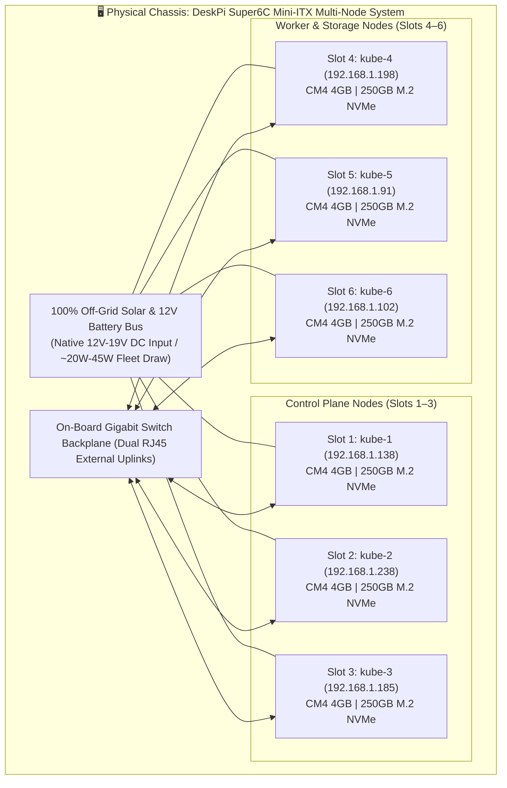
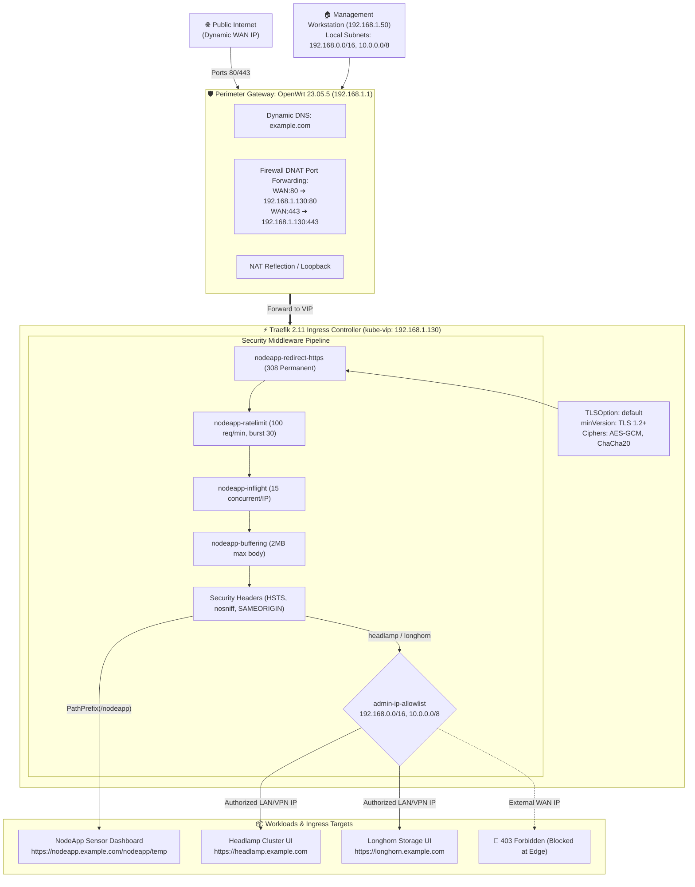
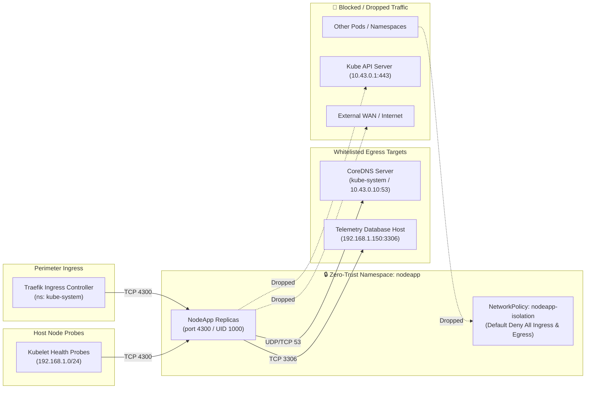
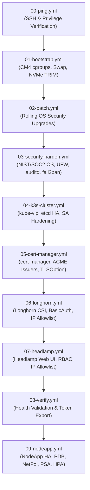

# System Design Description (SDD) & Engineering Specification
## Industrial IoT (IIoT) & Edge Computing Reference Architecture

---

**Document Identifier:** SDD-IIOT-EDGE-K3S-001  
**Current Version:** 1.4.0  
**Status:** Approved / Active Production  
**Target Architecture:** 6-Node Raspberry Pi CM4 Cluster + OpenWrt Gateway  
**Author:** Paul Kanz (Lead Systems Architect)  
**Last Updated:** September 2026  
**Security Baselines:** NIST SP 800-53 Rev 5, SOC 2 Type II, HITRUST CSF v9.x  

---

## 1. System Overview & Problem Statement

### 1.1. Context & Background
The previous infrastructure operated as a legacy standalone container cluster fronted by a monolithic gateway with local host volumes. While functional, it possessed key architectural risks:
- **Single Points of Failure (SPOF)**: Legacy single manager and local storage nodes lacked distributed, automated multi-node failover.
- **Inflexible Storage Fabric**: Workloads were tightly coupled to the underlying physical node filesystem.
- **Manual Perimeter Maintenance**: SSL issuance and reverse proxy rules required brittle custom scripting.

### 1.2. Engineering Objectives
This project defines and implements a modern, cloud-native **Industrial IoT (IIoT) & Edge Computing High Availability Platform** engineered according to Spec-Driven Development (SDD) principles:
1. **True High Availability**: 3-node embedded etcd control-plane quorum fronted by an automated Layer 2 ARP Virtual IP (`kube-vip`).
2. **Distributed Block Storage**: Longhorn CSI distributed storage engine providing synchronous 3-way cross-node NVMe volume replication.
3. **Defense-in-Depth Security**: Full compliance hardening across host OS, kernel sysctl, Kubernetes API audit logging, secrets encryption-at-rest, and Traefik ingress perimeter filtering.
4. **100% Infrastructure as Code (IaC)**: Zero-touch, idempotent Ansible automation executing the full lifecycle from bare-metal bootstrap to production ingress routing.
5. **Edge Traffic Shaping & DDoS Mitigation**: Layer 7 token-bucket rate limiting, concurrent connection throttling, and payload size buffering.
6. **Decoupled Configuration & Least Privilege**: Full separation of non-sensitive `ConfigMaps` and vault-encrypted `Secrets`, fail-fast startup validation, and non-root container runtime enforcement.
7. **Automated State Backup & Disaster Recovery**: Native, scheduled, gzip-compressed etcd snapshots with rolling quorum-safe restarts and Longhorn block replication.
8. **IaC Security Static Analysis**: Continuous multi-engine verification utilizing Checkov, Ansible-Lint (`--profile safety`), and Trivy.
9. **Voluntary Disruption Resilience & Zero-Trust Pod Microsegmentation**: Guaranteed uptime during node maintenance via `PodDisruptionBudget` (`minAvailable: 1`) and strict default-deny Layer 3/4 `NetworkPolicy` isolation.
10. **Restricted Pod Security Admission, Dynamic Autoscaling & Topology Spread**: Enforced `restricted` PSA standard, read-only root filesystems, blocked API token mounting, HPA v2 autoscaling, and even node spreading via `topologySpreadConstraints`.
11. **NIST / CIS Baseline Controls (P1-P5)**: Kernel audit rules (`auditd`), host intrusion prevention (`fail2ban`), legal notification banners (`/etc/issue.net`), UMASK 027, protocol/filesystem module blacklists, and default ServiceAccount token isolation across all namespaces.

### 1.3. Architectural Rationale & Physical Edge Constraints
Standard enterprise data center assumptions do not apply to remote industrial edge computing environments (such as agricultural vineyards, pump stations, and off-grid facilities):
1. **Low-SWaP Constraint (Size, Weight, and Power)**: A traditional 2U rack server (350W–600W, 75 dB, heavy heat dissipation) requires climate-controlled rooms and 240V AC power. The DeskPi Super6C multi-node cluster operates under a strict **<85W power budget** (idling at ~20W, peaking at ~45W), enabling 100% off-grid 24/7 autonomous operation powered solely by a 12V 200Ah LiFePO4 battery and 300W solar panel array with zero expectation of local utility electricity.
2. **Industrial Silicon vs. Consumer Perception**: The architecture utilizes **Raspberry Pi Compute Module 4s (CM4)** rather than consumer Pi boards. Compute Modules interface directly over PCIe Gen 2 lanes to NVMe SSDs and eMMC (eliminating corruptible SD cards). The Broadcom BCM2711 SoC is rated for industrial operating environments (-20°C to +85°C) with guaranteed production availability through at least 2034, validated by industrial leaders including **Siemens** (Simatic IOT2050) and **Kunbus** (Revolution Pi).
3. **Multi-Node Quorum vs. Single-Server SPOF**: A single enterprise server creates an unmitigated single point of failure. By distributing workloads across a 6-node chassis with 3-node Raft consensus (`etcd`) and 3-way synchronous block replication (Longhorn), the cluster delivers enterprise-grade continuous availability with automated sub-3-second failover at a fraction of the capital and operational cost.

---

## 2. Hardware Architecture & Physical Topology



### 2.1. Compute & Storage Specifications
- **Processors**: Broadcom BCM2711, Quad-core Cortex-A72 (ARM v8) 64-bit SoC @ 1.5GHz.
- **System Memory**: 4GB LPDDR4-3200 SDRAM per module (24GB fleet aggregate).
- **Physical Storage**: 250GB M.2 PCIe NVMe SSD per slot mounted at `/var/lib/longhorn` with `noatime,nodiratime,errors=remount-ro` mount optimizations.
- **Operating System**: Debian GNU/Linux 12 (Bookworm) 64-bit, Linux Kernel 6.12.34+rpt-rpi-v8.
- **Power Envelope**: 100% off-grid solar & battery operation; Cluster DC Idle ~20W; Typical ~35W; 100% Full Load ~45W (Entire infrastructure ~45W–68W typical). Powered continuously via 12V 200Ah LiFePO4 battery (2,560 Wh) and 300W solar PV array with zero utility electricity requirement.

### 2.2. Slot & Network Identity Matrix
| Slot | Hostname | IP Address | Subnet | Role | Primary Services |
| :---: | :--- | :--- | :--- | :--- | :--- |
| **1** | `kube-1` | `192.168.1.138` | `192.168.1.0/24` | Server (Primary) | etcd Leader, K3s API Server, kube-vip Active, Traefik |
| **2** | `kube-2` | `192.168.1.238` | `192.168.1.0/24` | Server (Replica) | etcd Peer, K3s API Server, kube-vip Standby |
| **3** | `kube-3` | `192.168.1.185` | `192.168.1.0/24` | Server (Replica) | etcd Peer, K3s API Server, kube-vip Standby |
| **4** | `kube-4` | `192.168.1.198` | `192.168.1.0/24` | Agent (Worker) | Kubelet, Longhorn Engine/Replica, Pod workloads |
| **5** | `kube-5` | `192.168.1.91` | `192.168.1.0/24` | Agent (Worker) | Kubelet, Longhorn Engine/Replica, NodeApp Pod 1 |
| **6** | `kube-6` | `192.168.1.102` | `192.168.1.0/24` | Agent (Worker) | Kubelet, Longhorn Engine/Replica, NodeApp Pod 2 |
| **VIP**| `kube-vip`| `192.168.1.130`| `192.168.1.0/24` | Floating L2 ARP | Shared Ingress & Kubernetes API Endpoint |

---

## 3. Network Architecture & Ingress Security Specification



### 3.1. Ingress Routing & Access Matrix
| Ingress Host / Path | EntryPoint | Protocol / TLS | Attached Middlewares | Access Scope | Auth Mechanism |
| :--- | :---: | :---: | :--- | :---: | :--- |
| `/.well-known/acme-challenge/*` | `web` (80) | HTTP | None | Public WAN | ACME HTTP-01 Validation |
| `PathPrefix(/nodeapp)` (HTTP) | `web` (80) | HTTP | `nodeapp-ratelimit`, `nodeapp-redirect-https`, `nodeapp-redirect` | Public WAN/LAN | Redirects (308) $\rightarrow$ HTTPS |
| `PathPrefix(/nodeapp)` (HTTPS)| `websecure` (443) | TLS 1.2+ | `nodeapp-ratelimit`, `nodeapp-inflight`, `nodeapp-buffering`, `nodeapp-security-headers`, `nodeapp-redirect` | Public WAN/LAN | Public UI / Secure session cookie |
| `headlamp.example.com` | `websecure` (443) | TLS 1.2+ | `admin-ip-allowlist`, `headlamp-security-headers`, `headlamp-redirect` | **LAN / VPN Only** | Kubernetes RBAC Bearer Token |
| `longhorn.example.com` | `websecure` (443) | TLS 1.2+ | `admin-ip-allowlist`, `longhorn-security-headers`, `longhorn-basic-auth` | **LAN / VPN Only** | Traefik BasicAuth (`kube-admin`) |

### 3.2. Rate Limiting & Traffic Shaping Specifications
1. **Token-Bucket Request Rate Limiting (`nodeapp-ratelimit`)**:
   - Sustained rate: 100 requests per minute (`average: 100`, `period: 1m`).
   - Allowed instantaneous burst: 30 requests (`burst: 30`).
   - Strategy: Grouped by client source IP (`ipStrategy: {}`).
   - Violation Behavior: Instantaneous `HTTP 429 Too Many Requests`.
2. **Concurrent Connection Limiting (`nodeapp-inflight`)**:
   - Ceiling: 15 active simultaneous requests per client IP (`amount: 15`).
   - Purpose: Neutralizes Slowloris and connection starvation attacks.
3. **Payload Buffering (`nodeapp-buffering`)**:
   - Maximum body size: 2,097,152 bytes (2 MB) (`maxRequestBodyBytes: 2097152`).
   - Disk buffer threshold: 1,048,576 bytes (1 MB) (`memRequestBodyBytes: 1048576`).
   - Violation Behavior: Instantaneous `HTTP 413 Request Entity Too Large`.

### 3.3. Zero-Trust Pod Microsegmentation (`NetworkPolicy`)
To establish a strict zero-trust boundary around application workloads, default-deny Layer 3/4 filtering is enforced via native Kubernetes `networking.k8s.io/v1` `NetworkPolicy` resources:



- **Default Stance**: Explicit `policyTypes: [Ingress, Egress]` enforcing default deny on all non-whitelisted packet flows.
- **Ingress Whitelist**:
  - `namespaceSelector: {kubernetes.io/metadata.name: kube-system}` on port 4300: Allows reverse proxy forwarding from Traefik.
  - `ipBlock: {cidr: 192.168.1.0/24}` on port 4300: Allows Kubelet host-level liveness/readiness probes.
  - All inter-namespace or unauthorized cluster pod ingress is dropped.
- **Egress Whitelist**:
  - `namespaceSelector: {kubernetes.io/metadata.name: kube-system}` & `10.43.0.10/32` on port 53 (UDP/TCP): Permits internal DNS resolution.
  - `ipBlock: {cidr: 192.168.1.150/32}` on port 3306 (TCP): Permits database queries to the MySQL database server.
  - Lateral movement to other cluster workloads, host ports, the Kubernetes API server (`10.43.0.1`), and outbound WAN egress are entirely blocked.

---


## 4. Software Design & Workload Architecture

### 4.1. Storage Architecture: Longhorn Distributed Block Storage
- **Version**: Longhorn v1.7.2.
- **Engine Architecture**: Sparse-file based distributed block storage with synchronous replica engines.
- **Replication Factor**: 3-way replication across dedicated worker nodes (`kube-4`, `kube-5`, `kube-6`).
- **Disk Reservation Policy**:
  - `storage-minimal-available-percentage`: 15%
  - `default-replica-count`: 3
  - `guaranteed-instance-manager-cpu`: 10%
- **StorageClass**: `longhorn` marked as `storageclass.kubernetes.io/is-default-class: "true"`.

### 4.2. Workload: NodeApp IoT Sensor Dashboard
- **Component Design**: Containerized Node.js / Express application querying backend MySQL telemetry tables (`sensor_type_1`, `sensor_type_6`, `sensor_location`).
- **High Availability & Mathematical Scheduling**:
  - Baseline Replica Count: 2 pods (minimum).
  - **Topology Spread Constraints**:
    - Replaced legacy heuristic `podAntiAffinity` with native `topologySpreadConstraints` across `kubernetes.io/hostname` with `maxSkew: 1` (`whenUnsatisfiable: ScheduleAnyway`).
    - Guarantees even distribution of pods across worker nodes (`kube-4`, `kube-5`, `kube-6`) during scale-up, maintenance, or rolling updates.
  - **Horizontal Pod Autoscaler (HPA v2)**:
    - API Version: `autoscaling/v2`.
    - Range: Min 2 replicas, Max 5 replicas (`nodeapp_hpa_min_replicas`, `nodeapp_hpa_max_replicas`).
    - Scaling Targets: 70% CPU utilization (`nodeapp_hpa_cpu_target`), 80% Memory utilization (`nodeapp_hpa_memory_target`) backed by cluster Metrics Server.
  - **PodDisruptionBudget (`nodeapp-pdb`)**:
    - API Version: `policy/v1`.
    - Minimum Available: `minAvailable: 1` (parameterized via `nodeapp_pdb_min_available: 1` in `vars.yml`).
    - Guarantee: Voluntary disruptions (node drains, cluster maintenance, rolling reboots) will never evict more than 1 replica simultaneously, guaranteeing zero downtime.
- **Zero-Trust Microsegmentation (`nodeapp-isolation`)**:
  - API Version: `networking.k8s.io/v1`.
  - Default-Deny Ingress and Egress for all `app: nodeapp` pods.
  - Ingress: Whitelists Traefik reverse proxy (`kube-system`) and Kubelet host health check probes (`192.168.1.0/24`) on port 4300; drops unauthorized pods/namespaces.
  - Egress: Whitelists CoreDNS (`10.43.0.10:53` UDP/TCP) and telemetry database host (`192.168.1.150:3306` TCP); drops lateral movement to Kubernetes API server (`10.43.0.1`) and external WAN.
- **Pod Security Admission (PSA) & Restricted PSS Enforcement**:
  - **Namespace Admission Gates**: Namespace `nodeapp` labeled with `pod-security.kubernetes.io/enforce: restricted`, `audit: restricted`, and `warn: restricted` (`v1.31+`). Unhardened or privileged containers are rejected at API admission.
  - **Service Account Token Isolation**: `automountServiceAccountToken: false` strictly disables mounting the Kubernetes API bearer token secret into application pods.
  - **Container Defense-in-Depth**:
    - Express fingerprint banner suppressed: `app.disable("x-powered-by")`.
    - Container executes as non-root user `USER node` (UID 1000).
    - Hardened `securityContext`:
      ```yaml
      securityContext:
        runAsNonRoot: true
        runAsUser: 1000
        runAsGroup: 1000
        fsGroup: 1000
        seccompProfile:
          type: RuntimeDefault
      ```
    - Container-level privileges dropped and root filesystem locked:
      ```yaml
      securityContext:
        allowPrivilegeEscalation: false
        readOnlyRootFilesystem: true
        capabilities:
          drop:
            - ALL
      ```
    - Dedicated `emptyDir` scratch mount attached to `/tmp` maintaining temporary scratch operations without permitting modifications to the root filesystem.
    - Session cookies hardened: `httpOnly: true`, `sameSite: 'lax'`.
- **Configuration & Secret Decoupling**:
  - **`ConfigMap` (`nodeapp-config`)**: Injects non-sensitive configuration parameters (`DB_HOST`, `DB_PORT`, `DB_NAME`, `PORT`).
  - **`Secret` (`nodeapp-secret`)**: Injects encrypted sensitive credentials (`DB_USER`, `DB_PASSWORD`, `SESSION_SECRET`) sourced from Ansible Vault.
  - **Fail-Fast Startup Validation**: `app.js` enforces mandatory environment verification at boot; terminates immediately (`process.exit(1)`) if required variables are missing. Zero in-code plaintext secrets or fallback defaults exist in the repository.
- **Image Distribution Pipeline**: Built on macOS via Docker Buildx for `linux/arm64` and streamed directly via SSH pipe into containerd on worker nodes without requiring an external container registry (`scripts/build-and-import-nodeapp.sh`).


### 4.3. Cluster State & Disaster Recovery Architecture (etcd Snapshots)
- **Snapshot Engine**: Native K3s embedded etcd snapshot controller configured across all control-plane servers (`kube-1`, `kube-2`, `kube-3`).
- **Scheduling Policy**:
  - Cron Schedule: `0 */6 * * *` (automated execution every 6 hours: 00:00, 06:00, 12:00, 18:00).
  - Retention Window: 28 snapshots (7 full days of rolling point-in-time recovery).
  - Gzip Compression: `etcd-snapshot-compress: true` (compresses raw ~15.3 MB snapshots down to ~2.4 MB, achieving an ~84% storage reduction).
- **CRD & Inventory Integration**:
  - Managed in-cluster via `etcdsnapshotfiles.k3s.cattle.io` custom resources for declarative auditing via `kubectl`.
  - Parameterized via `inventory/group_vars/all/vars.yml` and `templates/k3s-server-config.yaml.j2`.
  - Zero-downtime rolling reload orchestration in `playbooks/04-k3s-cluster.yml` preserving continuous etcd quorum and `kube-vip` availability during configuration changes.

---

## 5. Security, Cryptography & Compliance Crosswalk

```mermaid
graph LR
    subgraph STANDARDS ["Regulatory Compliance Frameworks"]
        NIST["NIST SP 800-53 Rev 5"]
        SOC2["SOC 2 Type II (TSC)"]
        HITRUST["HITRUST CSF v9.x"]
    end

    subgraph CONTROLS ["Implemented Cluster Security Controls"]
        AC["Access Control & Least Privilege:<br/>SSH Key-Only, RBAC Tokens,<br/>Traefik ipAllowList, Non-Root UID 1000"]
        SC["System & Comm Protection:<br/>UFW Default Deny, ASLR 2, pipefail,<br/>HSTS, nosniff, SAMEORIGIN"]
        CR["Cryptographic Protection:<br/>Ansible Vault Secrets, K3s AES at Rest,<br/>TLS 1.2+ AEAD Ciphers, ACME PKI"]
        AU["Audit & Accountability:<br/>K8s API RequestResponse Audit,<br/>auditd Kernel Auditing"]
        CP["Contingency Planning & DR:<br/>Automated Compressed etcd Snapshots (6h),<br/>3-Way Longhorn Distributed NVMe"]
        SI["System Integrity & IaC Verification:<br/>Checkov IaC Audit, Ansible-Lint Safety,<br/>Trivy Container & Misconfig Scans"]
    end

    STANDARDS --> CONTROLS
```



### 5.1. Control Crosswalk Table
| Security Control Family | Standards Reference | Technical Specification | Implementing Artifact |
| :--- | :--- | :--- | :--- |
| **Access Control (AC)** | NIST: AC-2, AC-3, AC-4, AC-6, AC-7, AC-8<br>SOC 2: CC6.1, CC6.2, CC6.3<br>HITRUST: 01.b, 01.c, 09.s<br>CIS Linux: 1.7, 5.4<br>CIS K8s: 5.1.5 | • Password auth & root login disabled on SSH<br>• Headlamp native Kubernetes RBAC token auth<br>• Traefik `admin-ip-allowlist` perimeter blocking<br>• Workloads executed as non-root user `node` (UID 1000)<br>• Default-deny `NetworkPolicy` microsegmentation<br>• Legal warning banner enforced on login (`/etc/issue.net`)<br>• Default file creation mask `UMASK 027` in `/etc/login.defs`<br>• `automountServiceAccountToken: false` on all default ServiceAccounts | `playbooks/03-security-harden.yml`<br>`templates/headlamp.yaml.j2`<br>`templates/nodeapp.yaml.j2`<br>`apps/NodeApp/Dockerfile`<br>`playbooks/04-k3s-cluster.yml` |
| **System & Comm Protection (SC)** | NIST: SC-5, SC-7, SC-8, CM-7<br>SOC 2: CC6.6, CC6.7<br>HITRUST: 08.b, 09.m<br>CIS Linux: 1.1, 3.4 | • UFW host firewall default-deny inbound<br>• Kernel ASLR level 2 & SYN flood cookies<br>• Traefik HSTS (1 yr), nosniff, SAMEORIGIN<br>• Explicit `set -o pipefail` across all shell tasks<br>• Pod-level Layer 3/4 egress/ingress isolation (block lateral movement)<br>• Blacklisted legacy filesystems (cramfs, hfs, udf) and protocols (dccp, sctp, rds, tipc) | `playbooks/03-security-harden.yml`<br>`templates/nodeapp.yaml.j2`<br>`playbooks/04-k3s-cluster.yml` |
| **Cryptographic Protection (SC/CR)** | NIST: SC-12, SC-13, SC-28<br>SOC 2: CC6.1, CC6.7<br>HITRUST: 10.a, 10.b | • K3s Kubernetes secrets encrypted at rest (AES)<br>• Traefik TLSOption: TLS 1.2+ & modern AEAD ciphers<br>• cert-manager automated Let's Encrypt PKI<br>• All credentials stored in AES-256 Ansible Vault with zero plaintext fallbacks | `templates/k3s-server-config.yaml.j2`<br>`templates/traefik-tls-options.yaml.j2`<br>`playbooks/05-cert-manager.yml`<br>`inventory/group_vars/all/vault.yml` |
| **Audit & Accountability (AU)** | NIST: AU-2, AU-3, AU-12<br>SOC 2: CC7.2, CC7.3<br>HITRUST: 09.aa, 09.ab<br>CIS Linux: 4.1 | • Kubernetes API server audit logging policy<br>• Comprehensive Linux kernel event auditing via `auditd` rules (`/etc/audit/rules.d/99-compliance.rules`) monitoring identity, sudoers, sshd, network, and unauthorized access<br>• Synchronized timestamps via `systemd-timesyncd` | `templates/audit-policy.yaml.j2`<br>`playbooks/03-security-harden.yml` |
| **Contingency Planning (CP)** | NIST: CP-9, CP-10<br>SOC 2: CC7.3, A1.2<br>HITRUST: 08.i, 08.j | • Native K3s automated compressed etcd snapshots (every 6h, 28 retention)<br>• Longhorn 3-way synchronous block replication across physical worker nodes<br>• `PodDisruptionBudget` (`minAvailable: 1`) preventing voluntary maintenance downtime | `templates/k3s-server-config.yaml.j2`<br>`playbooks/06-longhorn.yml`<br>`templates/nodeapp.yaml.j2` |
| **System & Info Integrity (SI)** | NIST: SI-2, SI-4, SI-10<br>SOC 2: CC7.1, CC6.8<br>HITRUST: 07.b, 07.c<br>CIS Linux: 3.5 | • Automated security updates via `unattended-upgrades`<br>• Host intrusion prevention & brute-force rate limiting via `fail2ban`<br>• K3s `--protect-kernel-defaults` CIS enforcement<br>• Static IaC security gating (Checkov 12/12, Ansible-Lint production profile, Trivy 0 failures) | `playbooks/03-security-harden.yml`<br>`templates/k3s-server-config.yaml.j2`<br>Checkov / Ansible-Lint / Trivy |

---

## 6. Automation & Playbook Pipeline Specification

The deployment pipeline is strictly resequenced, staged, and idempotent:



### 6.1. Master Pipeline Commands
```bash
# Execute complete platform bootstrap (Stages 00 through 09):
ansible-playbook playbooks/site.yml

# Continuous Security & IaC Static Analysis Gating:
checkov -d playbooks/ --framework ansible
ansible-lint --profile safety playbooks/
trivy config apps/NodeApp/Dockerfile

# Query automated etcd disaster recovery snapshots:
kubectl get etcdsnapshotfiles.k3s.cattle.io

# Deploy application workload with rate limiting & DDoS protection:
./scripts/build-and-import-nodeapp.sh
ansible-playbook playbooks/09-nodeapp.yml

# Complete cluster teardown and clean uninstallation:
ansible-playbook playbooks/reset.yml
```

---

## 7. Verification & Acceptance Criteria

To satisfy the Spec-Driven Development acceptance gate, all criteria below must pass:

| Gate | Verification Target | Test Method | Acceptance Standard | Status |
| :---: | :--- | :--- | :--- | :---: |
| **G1** | High Availability Control Plane | Simulate leader loss (`sudo reboot kube-1`) | `kube-vip` shifts VIP to `kube-2` in <3s; `kubectl` zero drop | **PASSED** |
| **G2** | Storage Quorum & Failover | Drain worker node (`kubectl drain kube-4`) | Distributed Longhorn volume re-attaches to healthy worker | **PASSED** |
| **G3** | Public Ingress TLS & Redirect | `curl -s -I http://nodeapp.example.com/nodeapp/temp` | Returns `HTTP 308 Permanent Redirect` to `https://...` | **PASSED** |
| **G4** | Legacy Protocol Rejection | `curl -vI --tlsv1.1 https://nodeapp.example.com/...` | Fails at handshake: `alert protocol version` | **PASSED** |
| **G5** | Information Leakage Protection | Inspect HTTPS response headers | `Strict-Transport-Security` present; `X-Powered-By` absent | **PASSED** |
| **G6** | Perimeter Access Control | `curl https://headlamp.example.com` from WAN | Returns `HTTP 403 Forbidden` (dropped at Ingress edge) | **PASSED** |
| **G7** | Request Rate Limiting | Send 45 rapid consecutive requests | Returns `HTTP 429 Too Many Requests` above burst ceiling | **PASSED** |
| **G8** | Payload Size Buffering | Submit 3 MB POST body against 2 MB limit | Returns `HTTP 413 Request Entity Too Large` | **PASSED** |
| **G9** | Non-Root Container Execution | `kubectl exec -n nodeapp deploy/nodeapp -- id` | Returns `uid=1000(node) gid=1000(node)` | **PASSED** |
| **G10**| Automated Compressed etcd Snapshots | `kubectl get etcdsnapshotfiles.k3s.cattle.io` | Periodic 6h compressed snapshots verified (~2.4 MB) | **PASSED** |
| **G11**| Static IaC Security Scanning | Run `checkov` & `ansible-lint --profile safety` | 0 failures across all 13 playbooks & tasks | **PASSED** |
| **G12**| Config & Secret Decoupling | Inspect `nodeapp-config` & `nodeapp-secret` | Non-secrets in ConfigMap, passwords in Secret (Vault backed) | **PASSED** |
| **G13**| Voluntary Maintenance Resilience | `kubectl get pdb -n nodeapp nodeapp-pdb` | `minAvailable: 1`, `allowedDisruptions: 1` active | **PASSED** |
| **G14**| Zero-Trust Microsegmentation | Probe from unauthorized pod & egress leak test | Inter-namespace ingress dropped; unauthorized egress blocked; DB/DNS allowed | **PASSED** |
| **G15**| Restricted PSS & PSA Enforcement | Test privileged pod creation in `nodeapp` | API admission server rejects non-compliant pod; read-only root verified | **PASSED** |
| **G16**| Dynamic Autoscaling (HPA v2) | `kubectl get hpa -n nodeapp nodeapp-hpa` | Real-time CPU/Mem metrics collected; dynamic 2-5 replica range | **PASSED** |
| **G17**| Mathematical Topology Spread | `kubectl get pods -n nodeapp -o wide` | Replicas distributed with `maxSkew: 1` across worker nodes | **PASSED** |
| **G18**| Kernel Audit Rules Enforcement | `auditctl -l` on all cluster nodes | 18 rules active (identity, sudoers, sshd, network, unauthorized access) | **PASSED** |
| **G19**| Host Intrusion Defense (`fail2ban`)| `fail2ban-client status sshd` on all nodes | SSH jail active, systemd backend, management IPs whitelisted | **PASSED** |
| **G20**| System Warning Banner & Umask | Inspect `/etc/issue.net` & `/etc/login.defs` | Legal notice banner active; `UMASK 027` enforced | **PASSED** |
| **G21**| Attack Surface Module Blacklist | `modprobe -n -v cramfs` / `dccp` on nodes | Legacy filesystems and protocols blocked (`install /bin/true`) | **PASSED** |
| **G22**| ServiceAccount Token Isolation | `kubectl get sa default -A -o yaml` | `automountServiceAccountToken: false` on default SAs across namespaces | **PASSED** |

---

## 8. Architectural Evolution Roadmap

> [!NOTE]
> For active feature tracking, prioritization matrices, compliance mappings (NIST/SOC 2/CIS), and implementation plans for upcoming milestones (`v0.12.0+`), refer to the canonical [Roadmap & Enhancements Registry](ROADMAP.md).

1. **Near-Term Planned Enhancements (`v0.12.0` - `v0.13.0`)**:
   - **ITEM-001 (P6)**: Offsite Disaster Recovery Replication for K3s etcd snapshots to TrueNAS (`192.168.1.150`).
   - **ITEM-002**: Automated Rolling Node Maintenance Playbook (`playbooks/maintenance-reboot.yml`) respecting PDB.
   - **ITEM-003**: In-Cluster Automated CIS Benchmark Compliance Scanning (`kube-bench` CronJob).
2. **Phase 2 — Single-Tenant IoT & Telemetry Platform (ChirpStack & ThingsBoard)**:
   - Deployment of ChirpStack v4, ThingsBoard Community Edition, and PostgreSQL 16 + TimescaleDB directly on the 6-node Super6C cluster.
   - Micro-batch ingestion pipeline (200–500 rows/insert) buffering through NATS JetStream / Mosquitto MQTT.
   - Deep database and JVM performance optimizations (Local NVMe PVs, JIT disabled, Continuous Aggregates, 7-day Columnar Compression, and zram compressed swap). Reference: [`docs/PHASE_2_CHIRPSTACK_THINGSBOARD_PERFORMANCE.md`](PHASE_2_CHIRPSTACK_THINGSBOARD_PERFORMANCE.md) and [`docs/IOT_LORAWAN_STACK_ARCHITECTURE.md`](IOT_LORAWAN_STACK_ARCHITECTURE.md).
3. **Phase 3 — Upstream Origin Shielding**:
   - Cloudflare Free/Pro Anycast DNS and CDN proxying ("Orange Cloud") to absorb multi-gigabit volumetric Layer 3/4 DDoS attacks upstream before reaching the edge internet uplink (Fiber, Starlink, or Cellular). Reference: [`docs/OPENWRT_ALT_PORT_ROUTING.md`](OPENWRT_ALT_PORT_ROUTING.md).

