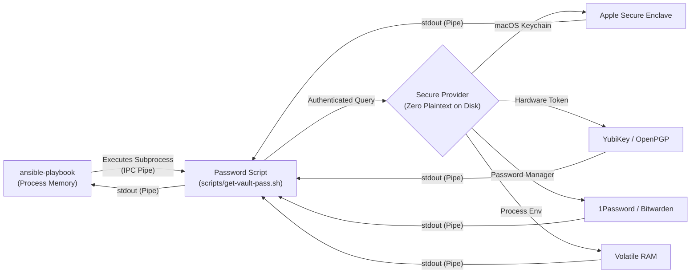

# Security Architecture: Zero-Disk Ansible Vault Credential Management
## Hardening Secrets Management Beyond Plaintext `.vault_pass` Files

**Target Architecture:** DeskPi Super6C Edge Cluster & K3s Management Workstation  
**Classification:** Operational Security (OpSec) & Compliance Hardening  
**Compliance Cross-Reference:** NIST SP 800-53 (IA-5, SC-12, SC-28), SOC 2 (CC6.1, CC6.2), CIS Linux Controls  

---

## 1. Threat Model & Security Rationale

Traditional Ansible configurations rely on a static plaintext file (e.g., `.vault_pass`) residing in the project root. While `.vault_pass` is excluded by `.gitignore`, storing cryptographic passphrases in plaintext on a workstation filesystem creates substantial threat vectors:

### 1.1. Core Threat Vectors Mitigated

```
+---------------------------------------------------------------------------------------+
|                                 THREAT VECTORS                                        |
+------------------------------------+--------------------------------------------------+
| 1. Accidental Git Ingestion        | Unintentional staging via `git add -f` or poorly |
|                                    | structured submodules exposing vault passphrases.|
+------------------------------------+--------------------------------------------------+
| 2. Workstation Compromise          | Info-stealer malware, malicious npm/pip packages,|
|                                    | or unauthorized users scanning for `.vault_pass`.|
+------------------------------------+--------------------------------------------------+
| 3. Unencrypted Backup Exposure     | Workstation Time Machine, rsync, or cloud backups|
|                                    | syncing local project trees to external storage.  |
+------------------------------------+--------------------------------------------------+
| 4. Forensic Residuals              | Deleted plaintext files lingering in unallocated |
|                                    | flash storage blocks or swap partitions.         |
+------------------------------------+--------------------------------------------------+
```

### 1.2. The Zero-Disk Principle
> [!IMPORTANT]
> **The Zero-Disk Principle**: At no point should the master encryption key exist as an unencrypted byte sequence on persistent storage media (NVMe, SSD, HDD). Keys must reside solely in **volatile process memory** or inside an **encrypted hardware/OS keystore** (macOS Secure Enclave, GPG SmartCard, or dedicated Key-Management Service).

---

## 2. Ansible Vault Dynamic Resolution Architecture

Ansible natively supports dynamic passphrase resolution through **executable password client scripts**:



When `vault_password_file` points to an **executable file with execute permissions (`chmod +x`)**, Ansible runs the program and captures its `stdout` as the encryption/decryption key. The script itself contains **zero credentials** and can be safely version-controlled.

---

## 3. Implementation Options (Ranked by Security & Workflow Fit)

### Option 1: macOS Keychain Services *(Recommended for Local Development)*
Integrates with macOS Keychain Services. The passphrase is AES-256 encrypted at rest and protected by macOS user login and the Apple T2/Apple Silicon Secure Enclave.

#### Step 1: Store Passphrase in Keychain
Execute in your macOS terminal (replacing `YOUR_MASTER_VAULT_PASSWORD`):
```bash
security add-generic-password -a "$USER" -s "super6c-vault-pass" -w "YOUR_MASTER_VAULT_PASSWORD" -U
```

#### Step 2: Create Executable Resolver Script
Create `scripts/get-vault-pass.sh`:
```bash
#!/usr/bin/env bash
# Description: Fetch Ansible Vault passphrase from macOS Keychain Services
# Exit immediately on failure to prevent empty password submission
set -eo pipefail

security find-generic-password -a "$USER" -s "super6c-vault-pass" -w
```

Set execution permissions:
```bash
chmod +x scripts/get-vault-pass.sh
```

#### Step 3: Configure `ansible.cfg`
Update `ansible.cfg` to reference the script:
```ini
[defaults]
vault_password_file = scripts/get-vault-pass.sh
```

---

### Option 2: Enterprise Password Manager CLI (1Password / Bitwarden)
Centralizes passphrase rotation and auditing across teams using CLI interfaces.

#### Method A: 1Password CLI (`op`)
1. Create a secure note or password item in your 1Password vault named `super6c-vault` with field `password`.
2. Create `scripts/get-vault-pass.sh`:
   ```bash
   #!/usr/bin/env bash
   set -eo pipefail
   op read "op://Private/super6c-vault/password"
   ```
3. Make executable: `chmod +x scripts/get-vault-pass.sh`.

#### Method B: Bitwarden CLI (`bw`)
1. Store credential in Bitwarden with item name `super6c-vault`.
2. Create `scripts/get-vault-pass.sh`:
   ```bash
   #!/usr/bin/env bash
   set -eo pipefail
   bw get password "super6c-vault"
   ```
3. Make executable: `chmod +x scripts/get-vault-pass.sh`.

---

### Option 3: GPG Asymmetric Encryption or Hardware Security Key (YubiKey)
Encrypts the passphrase using your personal GPG key or a hardware token (YubiKey OpenPGP applet). Even if the encrypted file is stolen, it cannot be decrypted without your hardware touch and PIN.

#### Step 1: Encrypt the Passphrase
```bash
echo "YOUR_MASTER_VAULT_PASSWORD" | gpg --encrypt --armor -r your-gpg-key-id > .vault_pass.gpg
chmod 600 .vault_pass.gpg
```

#### Step 2: Create Resolver Script
Create `scripts/get-vault-pass.sh`:
```bash
#!/usr/bin/env bash
set -eo pipefail
gpg --batch --quiet --decrypt .vault_pass.gpg 2>/dev/null
```
Make executable:
```bash
chmod +x scripts/get-vault-pass.sh
```

---

### Option 4: Ephemeral Environment Variables (CI/CD & Headless Automation)
Ideal for automated runners (GitHub Actions, GitLab CI) and temporary local shells. Keys reside strictly in process memory.

#### Local Terminal Usage
Pass directly during playbook invocation:
```bash
ANSIBLE_VAULT_PASSWORD="YOUR_MASTER_VAULT_PASSWORD" ansible-playbook -i inventory/hosts.yml playbooks/site.yml
```
Or export for the duration of a session (disappears when terminal window closes):
```bash
export ANSIBLE_VAULT_PASSWORD="YOUR_MASTER_VAULT_PASSWORD"
```

#### GitHub Actions Workflow Example
```yaml
- name: Run Playbook
  env:
    ANSIBLE_VAULT_PASSWORD: ${{ secrets.SUPER6C_VAULT_PASSWORD }}
  run: |
    ansible-playbook -i inventory/hosts.yml playbooks/site.yml
```

---

### Option 5: Interactive Terminal Prompt (Pure Paranoia, Zero Setup)
The password is requested interactively and held only in volatile memory for the duration of the command.

* **Via CLI flag:**
  ```bash
  ansible-playbook -i inventory/hosts.yml playbooks/site.yml --ask-vault-pass
  ```
* **Enforced in `ansible.cfg`:**
  ```ini
  [defaults]
  ask_vault_pass = True
  ```

---

## 4. Architectural Security Matrix

| Strategy | Storage Media | Key Protection | Automated Workflows? | Compliance Tier |
| :--- | :---: | :---: | :---: | :---: |
| **Plaintext `.vault_pass` (Default)** | ❌ Disk (Unencrypted) | Workstation filesystem permissions (`600`) | ✅ Yes | ❌ Fails SOC 2 / NIST |
| **macOS Keychain (Option 1)** | 🛡️ Secure Enclave | OS User Authentication + Hardware TPM | ✅ Yes | ⭐⭐⭐⭐⭐ High |
| **Password Manager CLI (Option 2)** | ☁️ Encrypted Vault | Multi-Factor Auth + Zero-Knowledge PBKDF2 | ✅ Yes | ⭐⭐⭐⭐⭐ High |
| **YubiKey / GPG (Option 3)** | 🔑 Hardware Token | Physical Human Touch + FIPS 140-2 CCID | ⚠️ Requires touch | ⭐⭐⭐⭐⭐ Highest |
| **Environment Variable (Option 4)** | 🧠 Volatile RAM | Process Isolation / Pipeline Secret Store | ✅ Yes | ⭐⭐⭐⭐☆ Server/CI Only |
| **Interactive Prompt (Option 5)** | 🧠 Volatile RAM | Human Memory | ❌ Interactive only | ⭐⭐⭐⭐☆ Manual Ops |

---

## 5. Migration & Verification Guide

To migrate from a legacy `.vault_pass` file to Zero-Disk Keychain security:

1. **Verify your existing password decrypts `vault.yml`:**
   ```bash
   ansible-vault view inventory/group_vars/all/vault.yml --vault-password-file .vault_pass
   ```
2. **Store secret into Keychain:**
   ```bash
   security add-generic-password -a "$USER" -s "super6c-vault-pass" -w "$(cat .vault_pass)" -U
   ```
3. **Verify Keychain retrieval:**
   ```bash
   security find-generic-password -a "$USER" -s "super6c-vault-pass" -w
   ```
4. **Securely shred and remove the plaintext file from disk:**
   ```bash
   # On macOS: overwrite with random bytes before unlinking
   srm -v .vault_pass 2>/dev/null || rm -P .vault_pass
   ```
5. **Test Ansible Vault decryption via script:**
   ```bash
   ansible-vault view inventory/group_vars/all/vault.yml --vault-password-file scripts/get-vault-pass.sh
   ```
