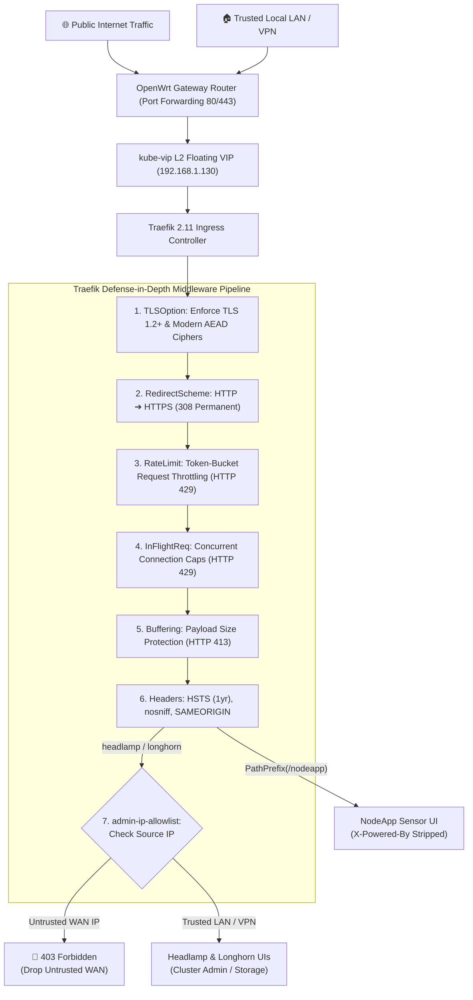

# Traefik Ingress Security, Rate Limiting & DDoS Mitigation Architecture

This document provides a comprehensive operational and tuning reference for the security hardening, rate limiting, connection throttling, and perimeter defense layers deployed across the Industrial IoT & Edge Computing K3s HA cluster.

---

## 1. Executive Summary

Public-facing services hosted on edge internet uplinks (such as Fiber, Starlink, or Cellular at `https://nodeapp.example.com/nodeapp/temp`) are exposed to external internet scans, automated script abuse, and application-layer (Layer 7) denial-of-service (DoS) attempts.

To safeguard the 6-node Raspberry Pi CM4 cluster, Linux kernel resources, and backend databases, Traefik acts as a **defense-in-depth perimeter**:



---

## 2. Attack Mitigation Matrix

| Threat / Attack Vector | Target Impact | Traefik Defense Layer | Enforcement Action |
| :--- | :--- | :--- | :--- |
| **High-Frequency Request Floods** | Node.js event-loop starvation & MySQL pool exhaustion | `nodeapp-ratelimit` (`rateLimit`) | Short-circuits with **`HTTP 429 Too Many Requests`** |
| **Slowloris Attacks** | File descriptor & connection table exhaustion | `nodeapp-inflight` (`inFlightReq`) | Caps active sockets per IP with **`HTTP 429`** |
| **Large Payload Bombs** | CM4 RAM exhaustion (4GB memory limit) | `nodeapp-buffering` (`buffering`) | Immediately rejects bodies >2MB with **`HTTP 413`** |
| **Unsolicited Admin Probing** | Compromise of Kubernetes cluster or block storage | `admin-ip-allowlist` (`ipAllowList`) | Blocks public WAN clients with **`HTTP 403 Forbidden`** |
| **Man-in-the-Middle / Downgrades**| Protocol eavesdropping & POODLE/BEAST exploits | `traefik-tls-options` (`TLSOption`) | Rejects TLS 1.0/1.1; enforces AES-GCM / ChaCha20 |
| **Clickjacking / MIME Sniffing** | Browser-side UI redressing & payload spoofing | `nodeapp-security-headers` (`headers`) | Injects `HSTS`, `nosniff`, `SAMEORIGIN` headers |
| **Framework Fingerprinting** | Targeted exploit targeting known framework CVEs | `app.disable("x-powered-by")` | Completely strips `X-Powered-By: Express` header |

---

## 3. Configuration & Tuning Reference

All settings are maintained as declarative Kubernetes Custom Resources (`traefik.io/v1alpha1`).

### 3.1. Request Rate Limiting (`nodeapp-ratelimit`)
* **File:** `templates/nodeapp.yaml.j2`
* **Namespace:** `nodeapp`

```yaml
apiVersion: traefik.io/v1alpha1
kind: Middleware
metadata:
  name: nodeapp-ratelimit
  namespace: nodeapp
spec:
  rateLimit:
    average: 100             # Maximum sustained requests allowed in the period
    period: "1m"             # Time window ("1m" = 1 minute, "1s" = 1 second)
    burst: 30                # Maximum burst of requests allowed above average
    sourceCriterion:
      ipStrategy: {}         # Groups requests strictly by client remote IP
```

#### Tuning Guidelines:
- **Tighter Protection (API-only):** Set `average: 30`, `period: "1m"`, `burst: 10`.
- **Looser Protection (Heavy Web UI):** Set `average: 200`, `period: "1m"`, `burst: 50`.
- **Per-Second Throttling:** Set `average: 5`, `period: "1s"`, `burst: 20`.

---

### 3.2. Concurrent Connection Limits (`nodeapp-inflight`)
* **File:** `templates/nodeapp.yaml.j2`
* **Namespace:** `nodeapp`

```yaml
apiVersion: traefik.io/v1alpha1
kind: Middleware
metadata:
  name: nodeapp-inflight
  namespace: nodeapp
spec:
  inFlightReq:
    amount: 15               # Maximum active simultaneous requests per client IP
    sourceCriterion:
      ipStrategy: {}         # Enforces limit per client IP (not global host)
```

#### Tuning Guidelines:
- `amount: 15` allows modern web browsers to open multiple HTTP/2 multiplexed streams while preventing attack tools (like `ab`, `wrk`, or Slowloris) from occupying excessive worker threads.

---

### 3.3. Request Buffering & Payload Caps (`nodeapp-buffering`)
* **File:** `templates/nodeapp.yaml.j2`
* **Namespace:** `nodeapp`

```yaml
apiVersion: traefik.io/v1alpha1
kind: Middleware
metadata:
  name: nodeapp-buffering
  namespace: nodeapp
spec:
  buffering:
    maxRequestBodyBytes: 2097152    # 2 MB max body size (drops with HTTP 413)
    memRequestBodyBytes: 1048576    # 1 MB threshold before disk spooling
```

#### Tuning Guidelines:
- Set `maxRequestBodyBytes` based on maximum expected payload (e.g. sensor telemetry payloads are <10 KB, so 2 MB provides ample headroom).

---

### 3.4. Perimeter IP Allowlisting (`admin-ip-allowlist`)
* **Files:** `templates/headlamp.yaml.j2`, `templates/longhorn-ingress.yaml.j2`
* **Namespaces:** `headlamp`, `longhorn-system`

```yaml
apiVersion: traefik.io/v1alpha1
kind: Middleware
metadata:
  name: admin-ip-allowlist
spec:
  ipAllowList:
    sourceRange:
      - "192.168.0.0/16"    # Covers cluster (192.168.1.x) & management networks
      - "10.0.0.0/8"         # Trusted LAN / VPN subnets
      - "172.16.0.0/12"      # Private RFC 1918 subnets
      - "127.0.0.1/32"       # Loopback
```

---

### 3.5. Cryptographic TLS Policy (`traefik-tls-options`)
* **File:** `templates/traefik-tls-options.yaml.j2`
* **Namespace:** `kube-system` (`default`)

```yaml
apiVersion: traefik.io/v1alpha1
kind: TLSOption
metadata:
  name: default
  namespace: kube-system
spec:
  minVersion: VersionTLS12
  cipherSuites:
    - TLS_ECDHE_ECDSA_WITH_AES_128_GCM_SHA256
    - TLS_ECDHE_RSA_WITH_AES_128_GCM_SHA256
    - TLS_ECDHE_ECDSA_WITH_AES_256_GCM_SHA384
    - TLS_ECDHE_RSA_WITH_AES_256_GCM_SHA384
    - TLS_ECDHE_ECDSA_WITH_CHACHA20_POLY1305
    - TLS_ECDHE_RSA_WITH_CHACHA20_POLY1305
  sniStrict: false
```

---

## 4. File Locations & Management Workflow

### 4.1. Code Repository Architecture
| File Path | Description |
| :--- | :--- |
| `templates/nodeapp.yaml.j2` | NodeApp deployment, secret, rate limit, inflight, buffering, and ingress routes |
| `templates/headlamp.yaml.j2` | Headlamp UI manifest, RBAC, and `admin-ip-allowlist` middleware |
| `templates/longhorn-ingress.yaml.j2`| Longhorn UI ingress, basicAuth, and `admin-ip-allowlist` middleware |
| `templates/traefik-tls-options.yaml.j2` | Traefik cluster-wide TLS 1.2+ minimum and modern cipher suites |
| `playbooks/05-cert-manager.yml` | Deploys cert-manager and `traefik-tls-options.yaml` |
| `playbooks/09-nodeapp.yml` | Deploys NodeApp and all rate limiting middlewares |

### 4.2. On-Cluster Manifest Paths
On the primary control plane server (`kube-1`), files are rendered by Ansible into K3s auto-deploy directory:
* `/var/lib/rancher/k3s/server/manifests/nodeapp.yaml`
* `/var/lib/rancher/k3s/server/manifests/headlamp.yaml`
* `/var/lib/rancher/k3s/server/manifests/longhorn-ingress.yaml`
* `/var/lib/rancher/k3s/server/manifests/traefik-tls-options.yaml`

### 4.3. Live Inspection & Operational Commands
```bash
# Query active middlewares in nodeapp namespace
kubectl --kubeconfig ~/.kube/config-super6c-edge get middlewares.traefik.io -n nodeapp

# Live describe or edit rate limiting parameters
kubectl --kubeconfig ~/.kube/config-super6c-edge describe middleware.traefik.io nodeapp-ratelimit -n nodeapp
kubectl --kubeconfig ~/.kube/config-super6c-edge edit middleware.traefik.io nodeapp-ratelimit -n nodeapp

# View Traefik IngressRoutes and attached middleware chains
kubectl --kubeconfig ~/.kube/config-super6c-edge get ingressroutes.traefik.io -n nodeapp -o yaml
```

### 4.4. Applying Configuration Updates
1. Adjust tuning parameters in `templates/nodeapp.yaml.j2`.
2. Apply changes via Ansible:
   ```bash
   ansible-playbook playbooks/09-nodeapp.yml
   ```
   *Changes take effect immediately with zero pod or cluster downtime.*

---

## 5. Verification & Testing Playbook

### Test 1: Verify Payload Buffering Ceiling (HTTP 413)
Generate and send an oversized payload (3 MB against a 2 MB ceiling):
```bash
dd if=/dev/zero of=/tmp/large_payload.bin bs=1M count=3 2>/dev/null
curl -s -o /dev/null -w "HTTP Status: %{http_code}\n" -X POST --data-binary @/tmp/large_payload.bin https://nodeapp.example.com/nodeapp/temp
rm -f /tmp/large_payload.bin
```
**Expected Output:**
```text
HTTP Status: 413
```

---

### Test 2: Verify Burst Rate Limiting (HTTP 429)
Send rapid consecutive requests exceeding the burst limit of 30:
```bash
python3 -c '
import urllib.request, ssl
ctx = ssl.create_default_context()
url = "https://nodeapp.example.com/nodeapp/temp"
codes = {}
for i in range(45):
    try:
        req = urllib.request.Request(url, headers={"User-Agent": "ratelimit-probe"})
        with urllib.request.urlopen(req, context=ctx) as r:
            codes[r.status] = codes.get(r.status, 0) + 1
    except urllib.error.HTTPError as e:
        codes[e.code] = codes.get(e.code, 0) + 1
print("Observed Status Codes:", codes)
'
```
**Expected Output:**
```text
Observed Status Codes: {200: 38, 429: 7}
```

---

### Test 3: Verify Legacy TLS 1.0/1.1 Rejection
Verify that weak protocols are rejected at the TLS handshake:
```bash
curl -vI --tlsv1.1 --tls-max 1.1 https://nodeapp.example.com/nodeapp/temp 2>&1 | grep -i "alert protocol version"
```
**Expected Output:**
```text
* LibreSSL/3.3.6: error:1404B42E:SSL routines:ST_CONNECT:tlsv1 alert protocol version
```

---

### Test 4: Verify Admin Perimeter Access Control
Test access to administrative dashboards from LAN vs simulated external IP:
```bash
# Internal LAN access (from 192.168.1.x)
curl -s -I https://headlamp.example.com | head -n 1
# Expected: HTTP/2 307 (Redirects to /headlamp/)

curl -s -I https://longhorn.example.com | head -n 1
# Expected: HTTP/2 401 Unauthorized (Basic realm="traefik")
```
*External WAN requests receive `HTTP 403 Forbidden`.*

---

## 6. Upstream Protection: Volumetric DDoS (Layer 3/4)

While Traefik effectively neutralizes Layer 7 application abuse, **volumetric floods** (e.g. 5+ Gbps SYN floods or UDP amplification) can saturate the edge internet uplink (Fiber, Starlink, or Cellular) before packets reach Traefik.

### Recommended Next Steps for Complete Immunity:
1. **Cloudflare Free/Pro DNS & Proxy ("Orange Cloud")**:
   - Route domain traffic through Cloudflare's global Anycast edge network.
   - Cloudflare absorbs multi-Tbps volumetric attacks and conceals your public WAN IP.
2. **Origin Shielding**:
   - Update `admin-ip-allowlist` and `nodeapp` ingress to only permit Cloudflare's published IP ranges, dropping all direct WAN connections at the OpenWrt router.
